こんにちは！Azure Integration サポート チームの 川合 です。  
Standard Logic Apps （シングルテナント） をご利用のお客様も多いかと思いますが、App Service や Azure Functions と異なり、Standard Logic Apps では Azure Portal から AAD 認証の設定が出来ません。

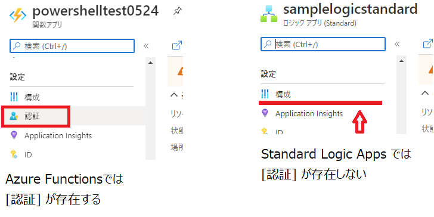

今回は、REST API を用いて Standard Logic Apps でも AAD 認証 (EasyAuth) を行う方法をご紹介いたします。

<!-- more -->

## 目次
- 事前準備・前提
- Azure Active Directory へのアプリ登録
- トークン取得
- Resource Explorer にて authsettingsV2 の更新
- AAD 認証による Standard Logic Apps の実行
- まとめ

## 事前準備・前提
今回の記事については以下の情報を参考にしております。
- [Trigger workflows in Standard logic apps with Easy Auth](https://techcommunity.microsoft.com/t5/integrations-on-azure-blog/trigger-workflows-in-standard-logic-apps-with-easy-auth/ba-p/3207378)

なお、本記事における REST API の実行方法については [postman](https://www.postman.com/downloads/) を利用してリクエストを送信します。そのため、Postman のインストール設定を事前に実施いただくことが前提の記事となります。
authsettingsV2 の更新については、[Resource Explorer](https://resources.azure.com/) を利用して更新いたします。

＜参考情報＞
[Azure App Service 認証でのファイルベースの構成](https://learn.microsoft.com/ja-jp/azure/app-service/configure-authentication-file-based)


途中でトークンのデコードを行う手順がございますが、 [jwt.io](https://jwt.io/) （もしくは [jwt.ms](https://jwt.ms/) ） というサイトで行います。

以上を基に、本記事では認証手順を記載いたします。

## Azure Active Directory へのアプリ登録
始めに、トークンを取得する為にお客様がご利用いただいている Azure Active Directory に対して "アプリの登録" を行います。
なお、トークンの取得方法については複数ございますため、お客様にとって容易な方法でご対応いただければと存じます。

＜アプリの登録手順＞
１．Azure Portal より Azure Active Directory を選択し、[アプリの登録] を選択。
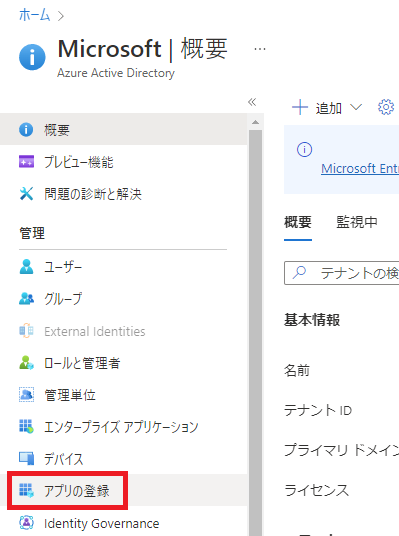

２．以下の内容で登録。
・名前 = 任意の値
・サポートされているアカウントの種類 = "この組織ディレクトリのみに含まれるアカウント (Microsoft のみ - シングル テナント)

以降変更なし。
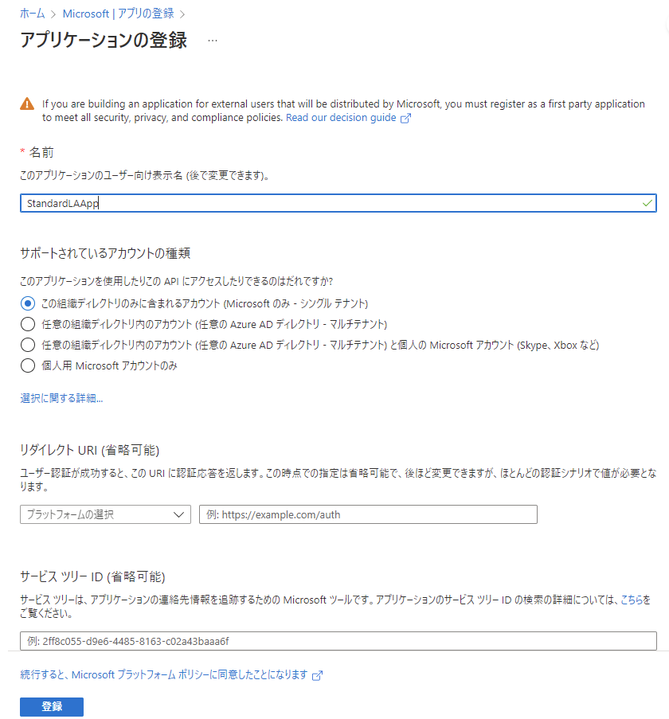


アプリの登録が出来ましたら、[概要] より以下の内容を控えていただきます。

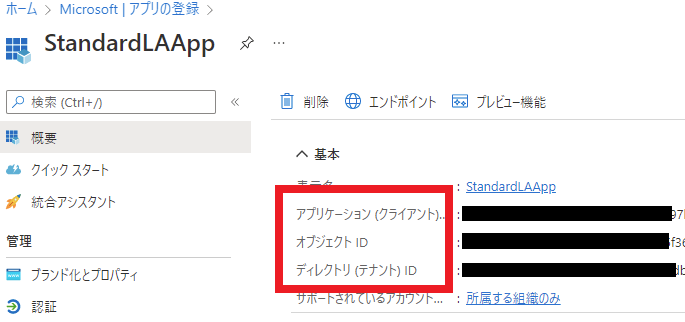

＜控える項目＞
・アプリケーション (クライアント) ID
・オブジェクト ID
・ディレクトリ (テナント) ID

次に、[証明書とシークレット] のメニューより、[新しいクライアント シークレット] を作成いただきます。
こちらについては有効期限はお客様の要件によって任意の値を設定下さいますようお願いいたします。
ここで表示されるクライアントシークレットの値は一度しか表示されませんので、確実にこの作成したタイミングで控えていただきますようお願いいたします。


＜控える項目＞
・値

次に、[管理] - [API の公開] のメニューより、[アプリケーション ID の URI] の 設定ボタンを選択します。

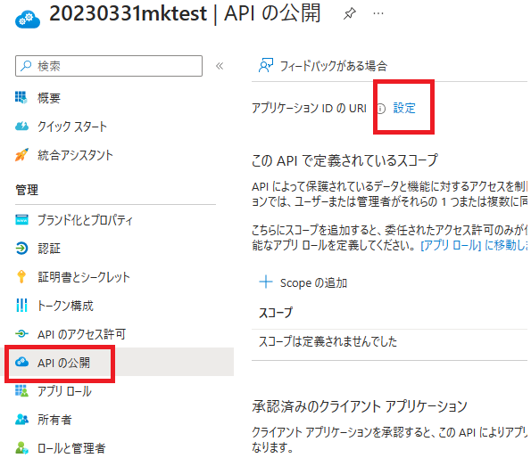

"api://" から始まるアプリケーション ID の URI が払い出されますので、保存ボタンを選択します。
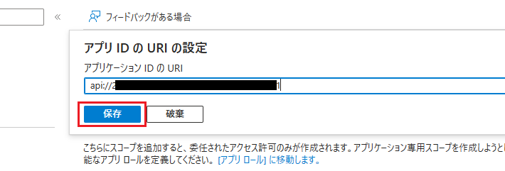

このタイミングで、"アプリケーション ID の URI" の値を控えておきます。


＜控える項目＞
・アプリケーション ID の URI 

最後に、[管理] - [マニフェスト] より、"accessTokenAcceptedVersion" の値を "2" に設定後、保存ボタンを選択します。
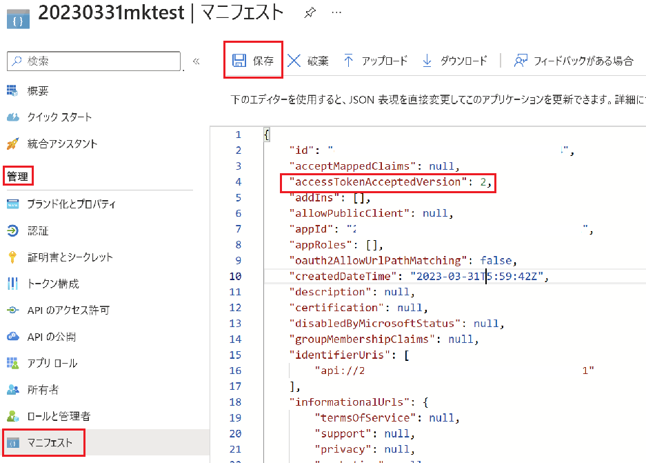

Azure Active Directory へのアプリ登録の方法については以上となります。次の手順で、認証に利用するトークンの情報を取得致します。

## トークン取得
続いて、AAD 認証に必要な REST API を設定いたします。まず、先に記載しました Postman を起動し、トークンを取得します。
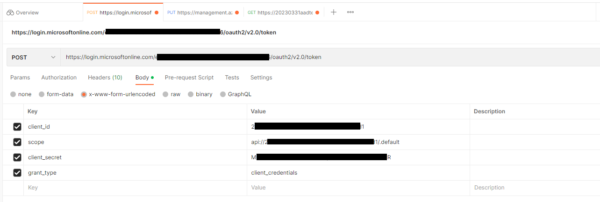

・POSTメソッド
https://login.microsoftonline.com/{ディレクトリ(テナント)ID}/oauth2/v2.0/token


Body には [x-www-from-urlencoded] を指定し、以下の内容を設定します。


client_id = AAD に登録したアプリの [アプリケーション (クライアント) ID] を指定
scope = {アプリケーション ID の URI}/.default 
client_secret = クライアントシークレットの [値]
grant_type = client_credentials

それ以外のパラメーターは特に設定不要でございます。

以上の設定が設定出来ましたら、画面右上の [Send] ボタンを選択し、リクエストを送信します。


リクエストが成功すると、Body の中にトークンの値が表示されますので、 "access_token" を全て控えていただきます。

＜控える項目＞
・access_token
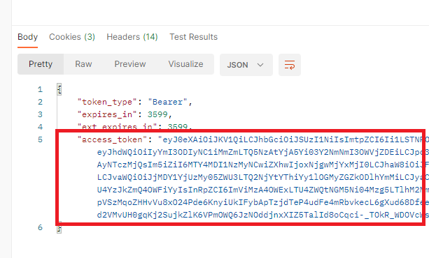


続いて、取得した "access_token" をデコードし、oid を取得することと、aud の値と作成したアプリの client_id を比較いたします。

[jwt.io](https://jwt.io/)

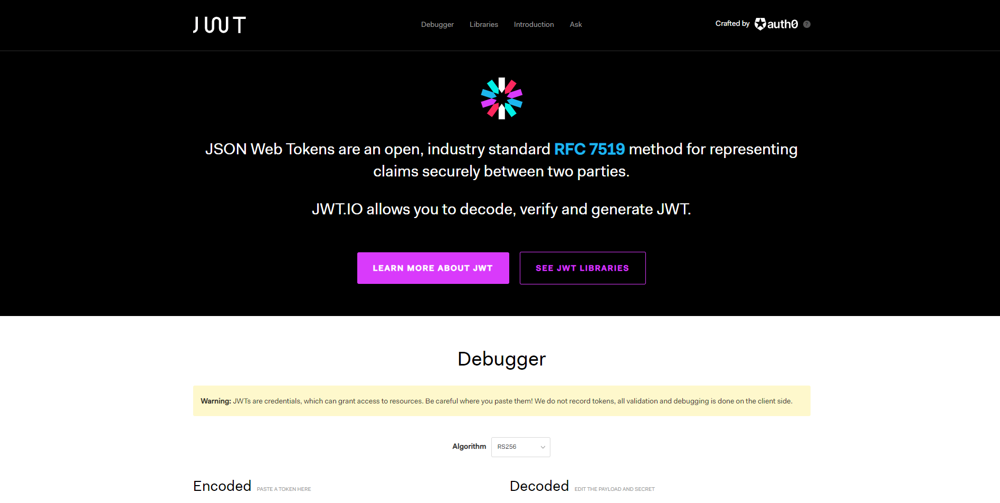

ブラウザで上記サイトを開いたら以下の [Encoded] に先ほどコピーした "access_token" を全て貼り付けます。


画面右側の [Decoded] - [PAYLOAD] の以下の値を値を控えていただきます。
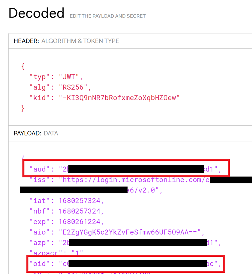

＜控える項目＞
・oid

ここで、aud の値と作成したアプリの client_id (アプリケーション (クライアント) ID) が同じものであることを確認します。

トークン取得の作業としては以上となりますが、"access_token" , "aud" および "oid" については後続の手順で利用しますので、そのまま残していただきますようお願いいたします。
なお、こちらのトークンにつきましては、通常 1 ~ 1.5 h の有効期限がございます。そのため、トークン発行後、有効期限が切れるたびに再取得する必要があることをご留意願います。

## Resource Explorer にて authsettingsV2 の更新
続いて、authsettingsV2 API を呼び出します。こちらは Standard Logic Apps に対して AAD 認証を行うための事前処理を行うものでございます。
こちらの手順では Resource Explorer を用いてリクエストを送信いたします。

初めに、以下の URL より Resource Explorer を起動いたします。
[Resource Explorer](https://resources.azure.com/)　

検索ボックスに今回 AAD 認証で起動したい Standard Logic Apps のリソース名を入力し、リソースプロバイダが "Microsoft.Web/sites" となっているものを選択します。


対象のリソースが確認出来ましたら、[config] - [authsettingsV2] を選択いたします。
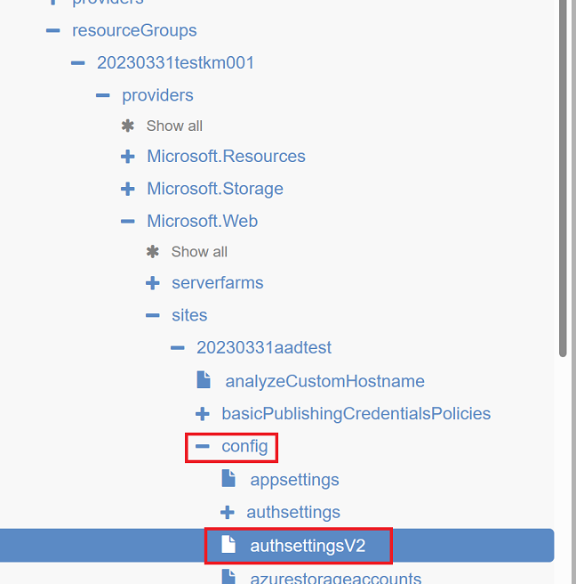

表示されている画面にて authsettingsV2 の REST API を実行することが可能ですので、画面上部の "Read/Write" より編集可能な状態に設定後、"Data (Get,PUT)" を選択し、[Edit] ボタンを選択いたします。
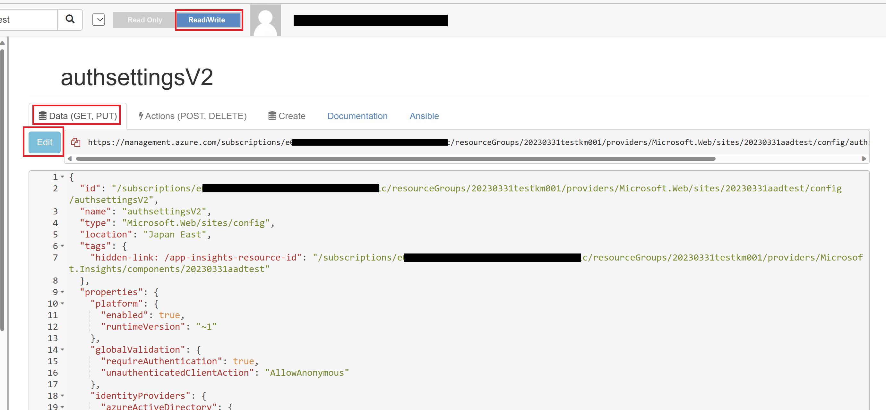

PUT メソッドで設定する Body について、以下の記事を参考に設定いただきます。

- [Trigger workflows in Standard logic apps with Easy Auth](https://techcommunity.microsoft.com/t5/integrations-on-azure-blog/trigger-workflows-in-standard-logic-apps-with-easy-auth/ba-p/3207378)

＜Body サンプル＞
```
{
    "id": "/subscriptions/{subscriptionId}/resourcegroups/{resourceGroupName}/providers/Microsoft.Web/sites/{logicAppName}/config/authsettingsV2",
    "name": "authsettingsV2",
    "type": "Microsoft.Web/sites/config",
    "location": "{locationOfLogicApp}",
    "tags": {},
    "properties": {
        "platform": {
            "enabled": true,
            "runtimeVersion": "~1"
        },
        "globalValidation": {
            "requireAuthentication": true,
            "unauthenticatedClientAction": "AllowAnonymous"
        },
        "identityProviders": {
            "azureActiveDirectory": {
                "enabled": true,
                "registration": {
                    "openIdIssuer": "{issuerId}",
                    "clientId": "{clientId}"
                },
                "login": {
                    "disableWWWAuthenticate": false
                },
                "validation": {
                    "jwtClaimChecks": {},
                    "allowedAudiences": [
                        "{audience1}",
                        "{audience2}"
                    ],
                    "defaultAuthorizationPolicy": {
                        "allowedPrincipals": {
                            "identities": [
                                "{ObjectId of AAD app}"
                            ]
                        }
                    }
                }
            },
            "facebook": {
                "enabled": false,
                "registration": {},
                "login": {}
            },
            "gitHub": {
                "enabled": false,
                "registration": {},
                "login": {}
            },
            "google": {
                "enabled": false,
                "registration": {},
                "login": {},
                "validation": {}
            },
            "twitter": {
                "enabled": false,
                "registration": {}
            },
            "legacyMicrosoftAccount": {
                "enabled": false,
                "registration": {},
                "login": {},
                "validation": {}
            },
            "apple": {
                "enabled": false,
                "registration": {},
                "login": {}
            }
        },
        "login": {
            "routes": {},
            "tokenStore": {
                "enabled": false,
                "tokenRefreshExtensionHours": 72.0,
                "fileSystem": {},
                "azureBlobStorage": {}
            },
            "preserveUrlFragmentsForLogins": false,
            "cookieExpiration": {
                "convention": "FixedTime",
                "timeToExpiration": "08:00:00"
            },
            "nonce": {
                "validateNonce": true,
                "nonceExpirationInterval": "00:05:00"
            }
        },
        "httpSettings": {
            "requireHttps": true,
            "routes": {
                "apiPrefix": "/.auth"
            },
            "forwardProxy": {
                "convention": "NoProxy"
            }
        }
    }
}
```

隅付き括弧で記載されているパラメーターについては以下の通り設定いたします。

・locationOfLogicApp = japaneast や japanwest 等 Standard Logicc Apps が存在するリージョン
・issuerId = "https://sts.windows.net/{ディレクトリ(テナント)ID}/ "
・clientId = トークンから取得した aud
・audience1 = AAD に登録したアプリの {アプリケーション ID の URI}
・audience2 = トークンから取得した aud
・ObjectId of AAD app = トークンから取得した oid

上記の通り Body が設定出来ましたら、[PUT] ボタンを選択します。
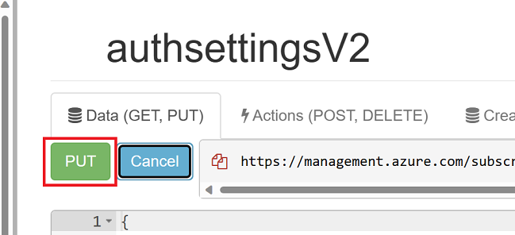

画面中央に緑色のチェックマークが表示されれば完了です。
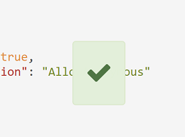

## AAD 認証による Standard Logic Apps の実行
以上の事前準備が出来ましたら、以下の REST API を実行し、Standard Logic Apps を実行致します。
なお、AAD 認証で呼び出す Standard Logic Apps のトリガーについては "HTTP 要求の受信時" トリガーである必要がございますため、ご留意いただきますようお願い申し上げます。


・POST メソッド
```
https://{logicAppName}.azurewebsites.net:443/api/{workflowName}/triggers/manual/invoke?api-version=2020-05-01-preview
```

・logicAppName = Standard Logic Apps （ワークフロー名ではない）
・workflowName = Standard Logic Apps に構築しているワークフロー名
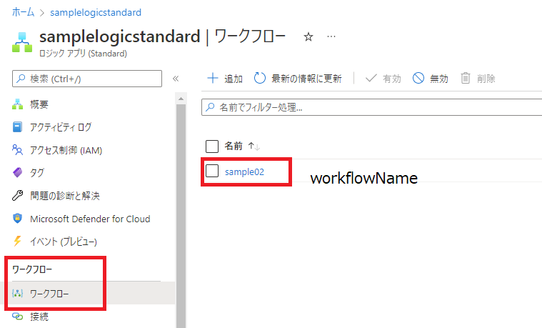


続いて、Postman の Headers に以下を追加いたします。

・KEY = Authorization
・VALUE = Bearer "access_token"
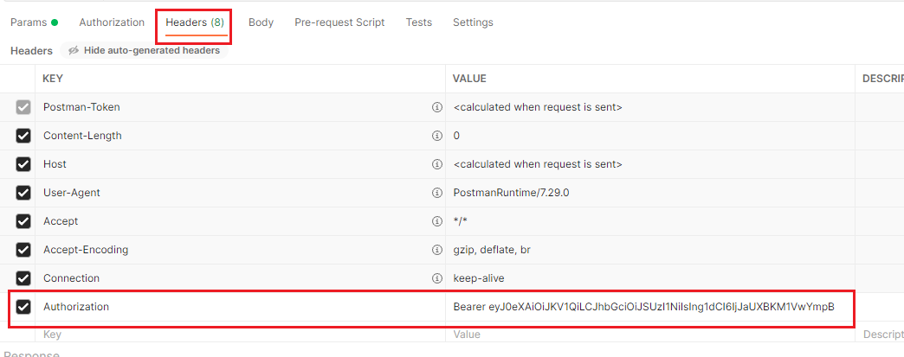

以上の設定が出来ましたら、画面右上の [Send] ボタンを選択し、リクエストを送信します。


Status 202 が表示されましたら無事 Standard Logic Apps のワークフローが AAD 認証によって実行されます。


Standard Logic Apps の実行結果に Postman から実行されたログが出力されます。
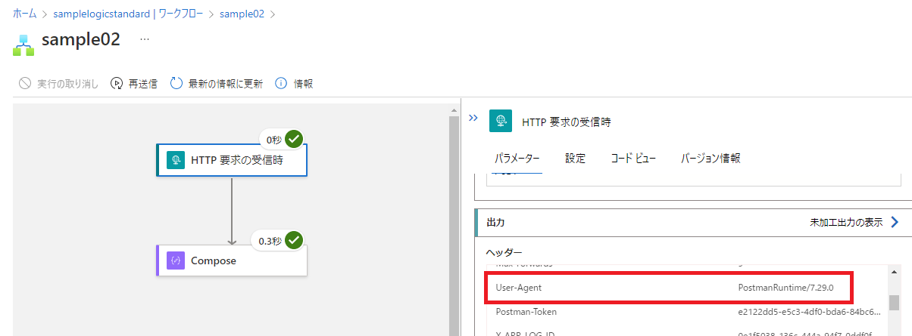

以上の手順にて、AAD 認証を用いてStandard Logic Apps を実行することが可能でございます。


## まとめ
本記事では、以下についてご案内いたしましたが、ご理解いただけましたでしょうか。
- 事前準備・前提
- Azure ActiveDirectory へのアプリ登録
- トークン取得
- Resource Explorer にて authsettingsV2 の更新
- AAD 認証による Standard Logic Apps の実行

本記事が少しでもお役に立ちましたら幸いです。最後までお読みいただき、ありがとうございました！

<Azure Logic Apps の参考サイト>
-- 概要 - Azure Logic Apps とは
https://learn.microsoft.com/ja-jp/azure/logic-apps/logic-apps-overview
Azure Logic Apps とは、ロジック アプリ デザイナーでフロー チャートを用いて作成したワークフローを自動実行するソリューションです。
Azure Logic Apps では、条件分岐などを実装することができ、ワークフローの実行状況に応じて実行する処理を分岐することが可能です。
