こんにちは！Azure Integration サポート チームの 川合 です。  

本記事は弊社海外ブログを日本語向けに解説した記事となります。

- [Get iteration index in Foreach action](https://techcommunity.microsoft.com/t5/integrations-on-azure-blog/get-iteration-index-in-foreach-action/ba-p/3730379)

Logic Apps で配列内のデータを処理する際、For each アクションのループでインデックスを取得し（現在何番目の配列に対する処理かを判断）、処理を行いたい場合があるかと思います。
その際は、コンカレンシ―制御を以下のように 1 に設定し、各繰り返し回数ごとに常に 1 ずつ加算されるインデックスとして変数を使用する手法がございます。


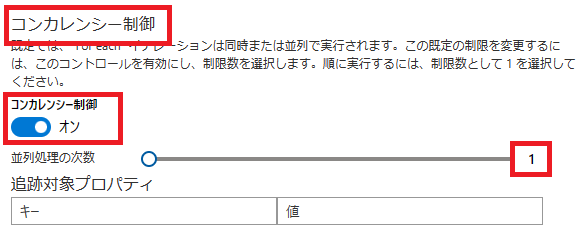

しかし、この方法では For each 処理がシーケンシャルな処理であるため、並列実行が出来ずパフォーマンスに影響を及ぼすことがあります。

今回は、For each アクションを並列実行して、効率的にインデックスを利用する構成と、従来の処理との比較結果についてご案内いたします。

<!-- more -->

## 目次
- 1． 従来の手法
- 2． 本手法での処理の設定方法
- 3． 本手法での構成および処理時間の比較
- まとめ

## 1． 従来の手法
まず、今回の前提となる従来の構成がどのような場合を記載しているかについて説明いたします。
例えば、以下のようなフローがあるとします。

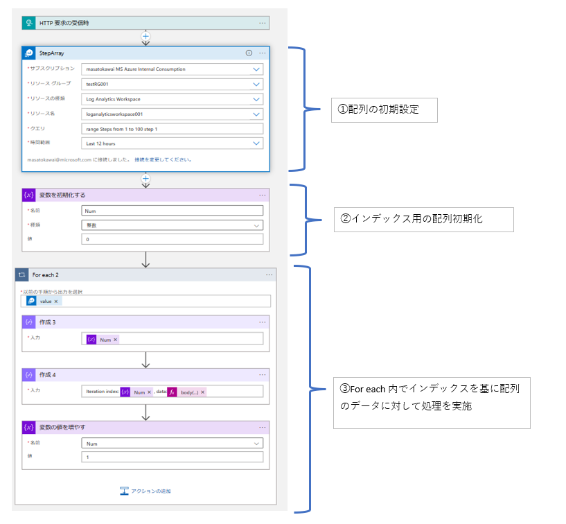

一つ目のアクションでは、テストで使用する配列のデータを用意いたします。
本記事では Azure Monitor ログ コネクタを基に以下の range 演算子で配列データを動的に作成しておりますが、配列形式のアクションであれば変数アクションで設定いただいても構いません。任意の構成で配列データを準備いただければと思います。

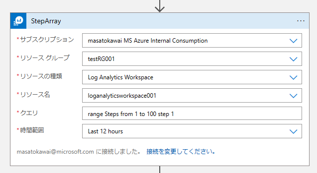

- [Azure Monitor Logs](https://learn.microsoft.com/ja-jp/connectors/azuremonitorlogs/)

- [range 演算子](https://learn.microsoft.com/ja-JP/azure/data-explorer/kusto/query/rangeoperator)

参考までに、本アクションでは以下のような結果となります。

＜クエリ＞
range Steps from 1 to 12 step 1

<結果>
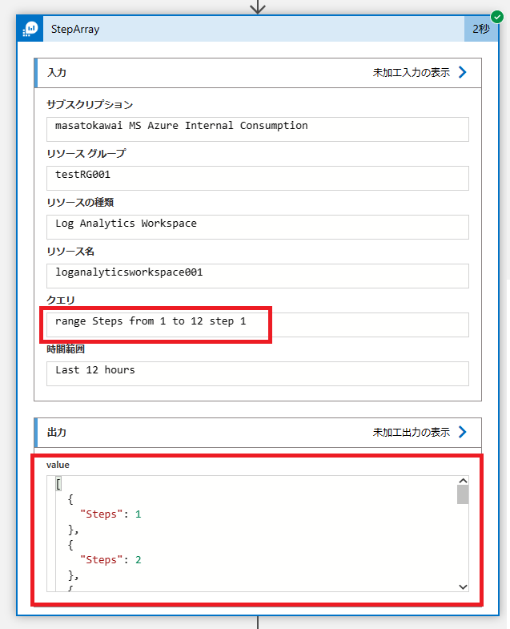

Steps と記載された配列要素が 12 個作成されます。

次に、以下の "変数を初期化する" アクションを後続に指定します。


こちらは For each 内で配列のインデックスとして利用いたします。

なお、元記事の構成では上記の通り Azure Monitor ログコネクタを利用しておりますが、以下の通り range 式関数でも配列を作成することが可能でございます。

- [range](https://learn.microsoft.com/ja-jp/azure/logic-apps/workflow-definition-language-functions-reference#range)
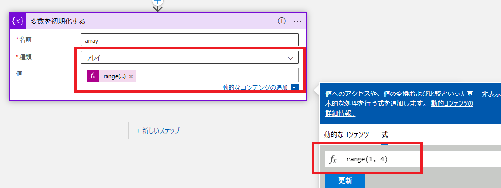

<結果>


こちらも参考までにご確認いただけますと幸いです。

次に、以下のような構成の For each アクションを後続に指定します。
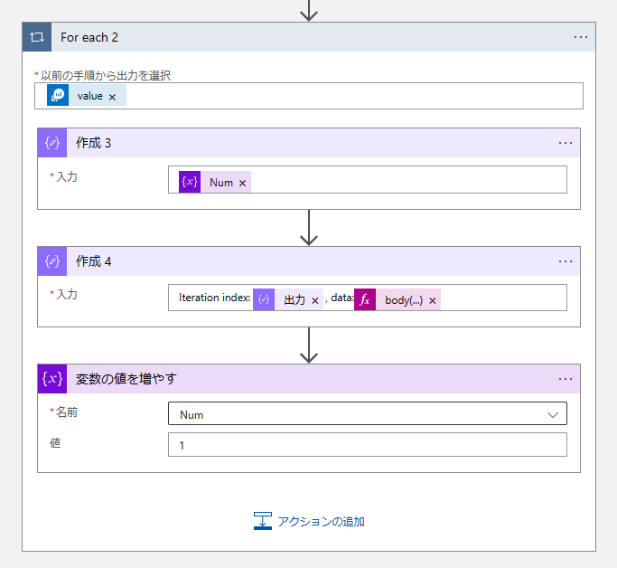

詳細について以降で説明いたします。

まず、For each の "以前の手順から出力を選択" については、動的コンテンツの変数より "value" を指定いたします。
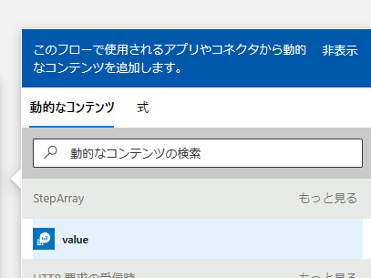

一つ目の作成アクションでは "変数を初期化する" で作成した変数を指定しましす。


二つ目の作成アクションでは以下のような式関数を指定しましす。


以下、コードビューの例となります。
```
Iteration index: @{outputs('作成_3')}, data:@{body('StepArray')?['value'][outputs('作成_3')]}
```
こちらの処理で、インデックスを基に最初に設定した配列の要素を取得致します。

三つ目のアクションでは変数をインクリメント致します。


ここまでの設定が出来ましたら、以下の通り For each のコンカレンシー制御を 1 に設定いたします。
（1 にせず並列実行にした場合、変数の値が正常に加算されない）

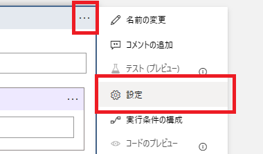
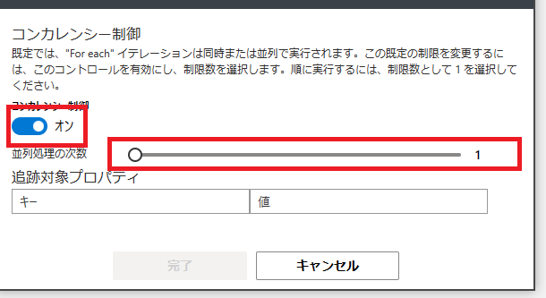

出力結果については、以下の通り順次実行で配列の値を取得することが可能ではございますが、1 つずつ取得することとなるのでパフォーマンスに影響が発生します。
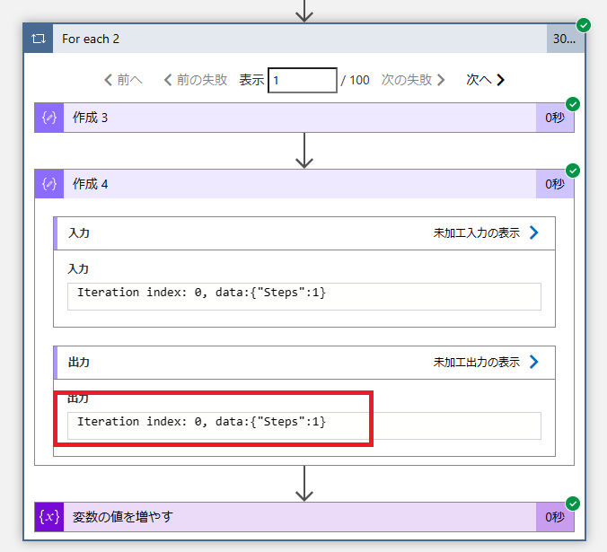

以上が前提となる処理になります。こちらの内容について、以下の手順で処理速度を改善する方法を記載いたします。

## 2． 処理の設定方法
本記事の処理構成として、以下のような構成となります。

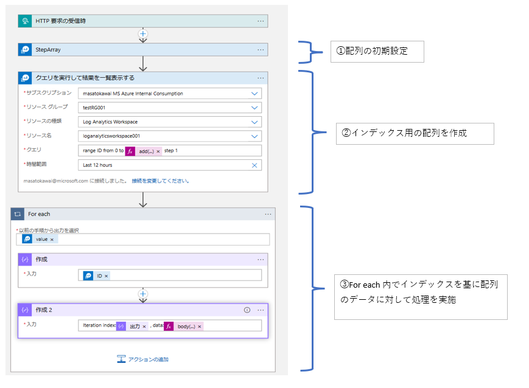　 

一つ目のアクションについては "1． 従来の手法での処理時間" で記載した内容と同様に配列の作成となるため説明を割愛いたします。

二つ目のアクションについて、処理する必要のあるすべてのインデックスを保存した新しい配列を生成する
処理となります。例えば、10 項目の配列があった場合、インデックス配列は [ 0, 1, 2 ... 9 ] のように生成する必要があります（0 から始まり、[配列長 - 1]で終わります）。

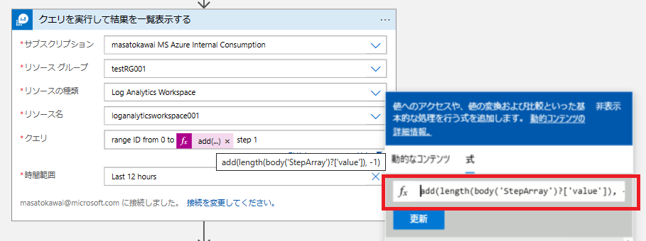　 

以下、コードビューの例となります。
```
range ID from 0 to @{add(length(body('StepArray')?['value']), -1)} step 1
```

<結果>
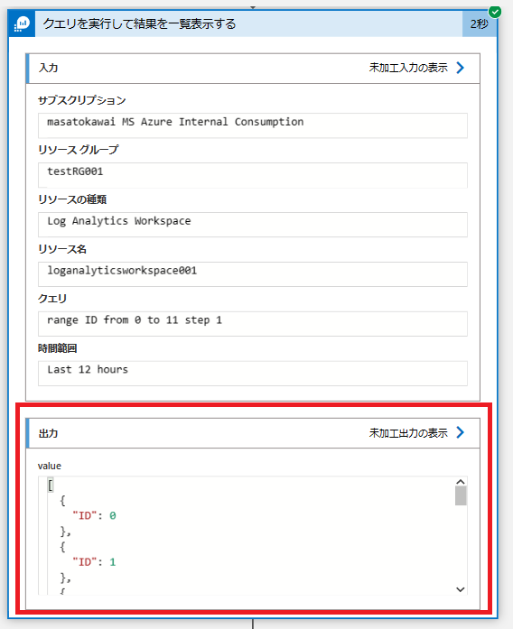　 

次に、以下のような構成の For each アクションを後続に指定します。
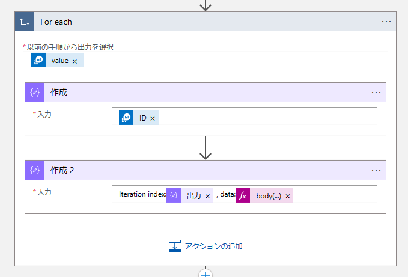　 

詳細について以降で説明いたします。

まず、For each の "以前の手順から出力を選択"　については、先ほど作成したインデックスの配列を指定いたします。本例では "クエリを実行して結果を一覧表示する" の "value" を指定します。


一つ目の作成アクションでは以下の式関数を指定いたします。


以下、コードビューの例となります。
```
@{items('For_each')['ID']}
```
こちらのアクションについては現在 For each で参照しているアイテムのインデックスを取得している処理となります。

二つ目の作成アクションでは以下の式関数を指定いたします。

```
Iteration index:@{outputs('作成')} , data:@{body('StepArray')?['value'][outputs('作成')]}
```
こちらの処理で、インデックスを基に最初に設定した配列の要素を取得致します。

出力結果については、For each の外であらかじめ作成したインデックスと紐づけて配列のデータを取得することで、並列実行処理で配列の値を取得することが可能でございます。
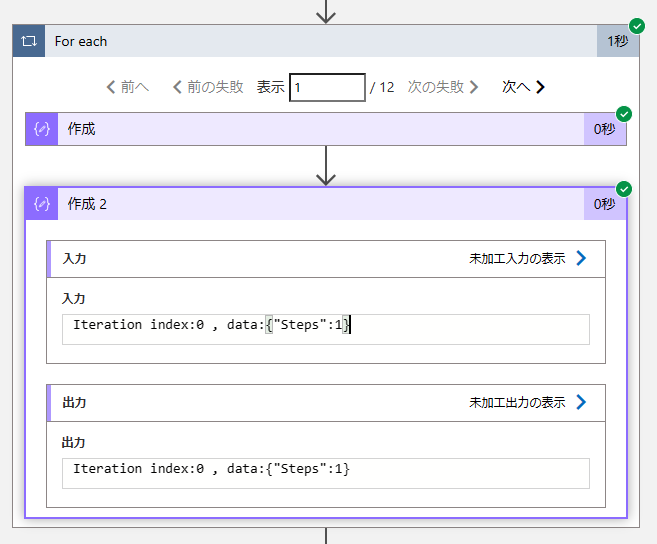

## 3．本手法での構成および処理時間
上記構成について配列要素数を 1000 にした状態でそれぞれ実行時間の比較検証を実施致しました。
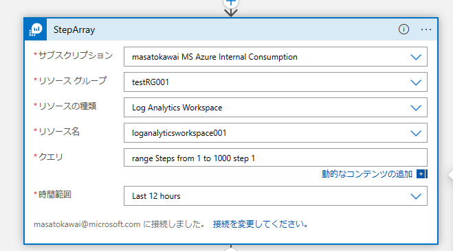

本記事の元となっているブログにも 90 % 近く処理時間の削減が出来たと記載がございますが、
本ブログの執筆時の検証結果としましても同様の結果となりました。

予め作成したインデックスと紐づけた場合：22 秒
For each 内でインデックスと紐づけた場合：6 分
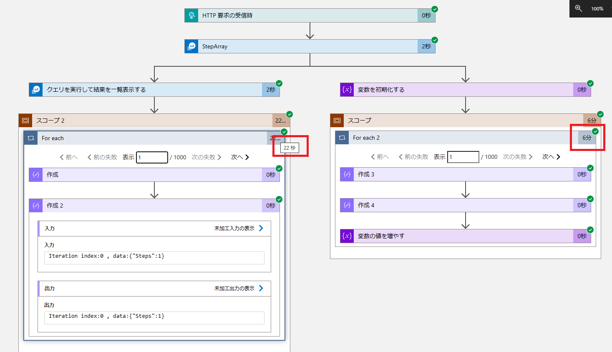

以上、For each 処理におけるインデックスの取得方法についてご案内いたしました。
こちらの記事について、ご参考までにご一読いただければと思います。

## まとめ
本記事では、以下の 3 点について、海外ブログを基にご案内いたしました。

- 1． 従来の手法
- 2． 処理の設定方法
- 3． 本手法での構成および処理時間の比較

本記事が少しでもお役に立ちましたら幸いです。最後までお読みいただき、ありがとうございました！

<Azure Logic Apps の参考サイト>
-- 概要 - Azure Logic Apps とは
https://learn.microsoft.com/ja-jp/azure/logic-apps/logic-apps-overview
Azure Logic Apps とは、ロジック アプリ デザイナーでフロー チャートを用いて作成したワークフローを自動実行するソリューションです。
Azure Logic Apps では、条件分岐などを実装することができ、ワークフローの実行状況に応じて実行する処理を分岐することが可能です。
