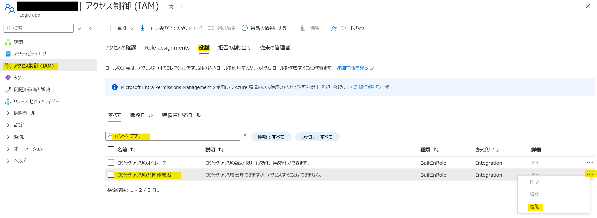
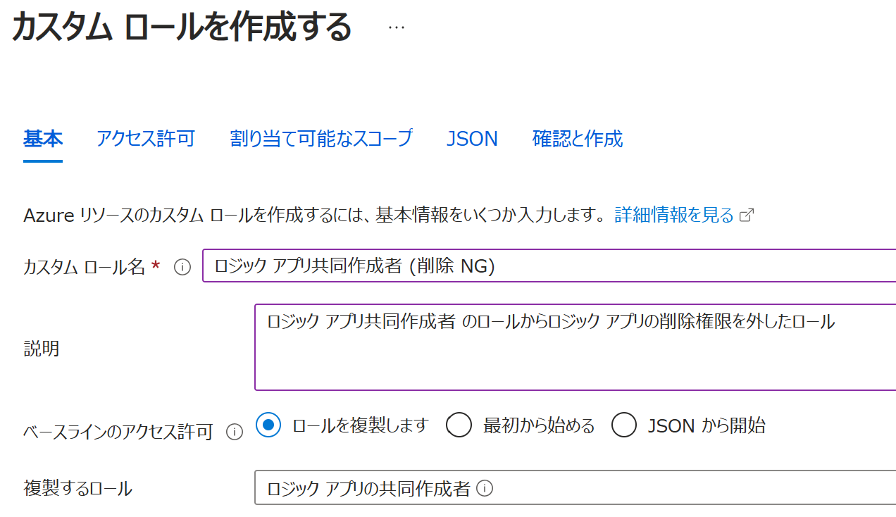
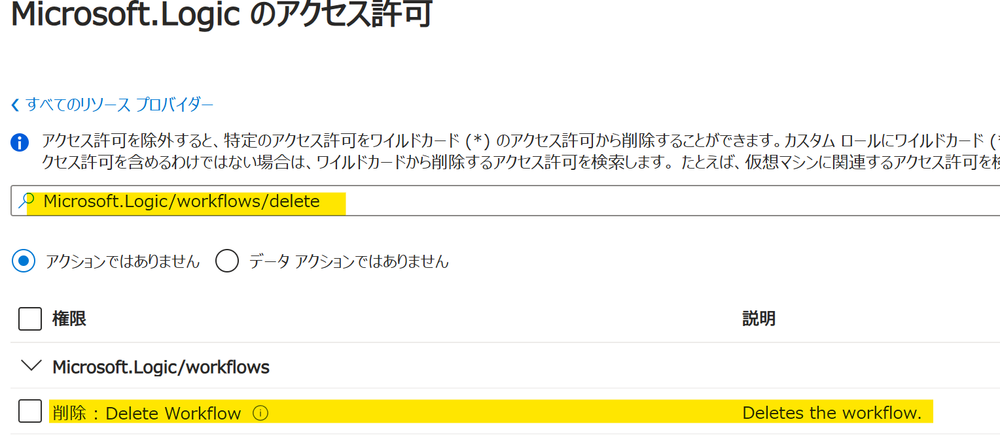
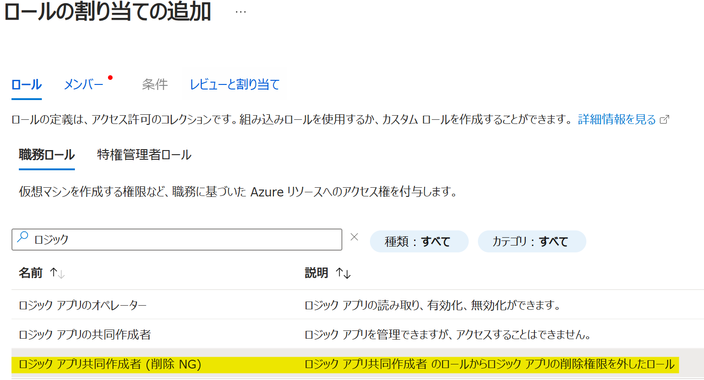
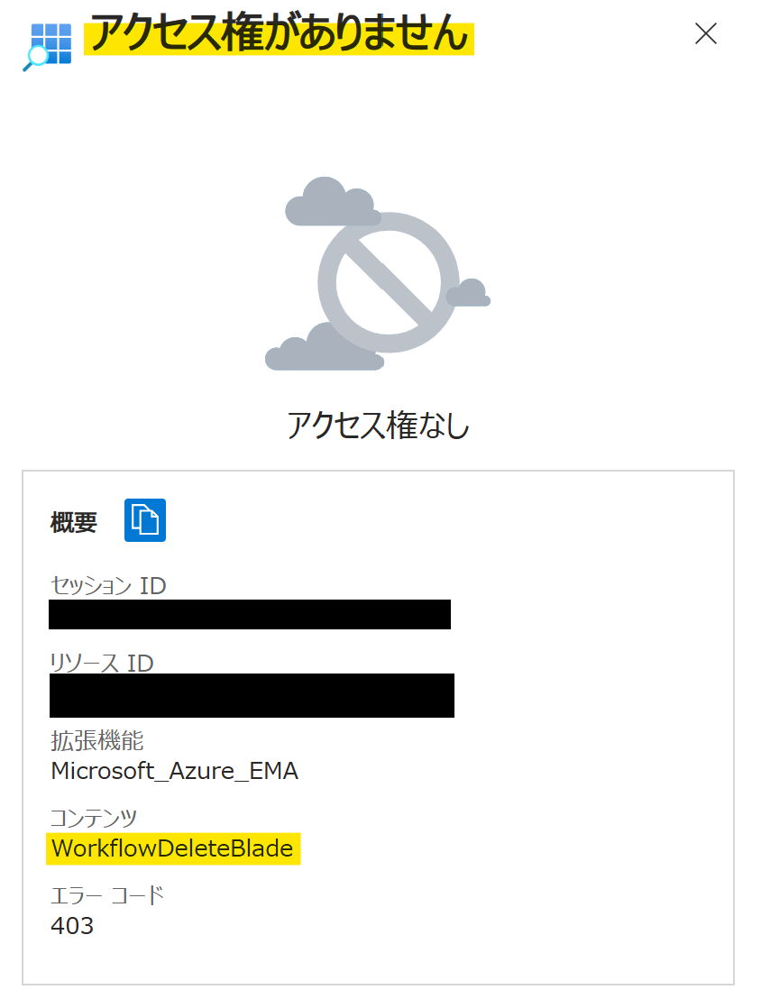

こんにちは。  Azure Integration サポート チームの継松です。  
今回は、 従量課金タイプの Logic Apps に対してのカスタム ロールの作成方法についてご紹介いたします！

本記事では、既に作成済みのリソースに対して保守するための編集・読み取り権限を付与しつつ、削除は出来ないようなロールを作成します。
ご要件に沿って、必要な権限を付与・除外することが可能ですのでご参考いただけますと幸いでございます。

<!-- more -->

## 目次
- Azure カスタム ロールについて
- カスタム ロールを作成する
- 関連ドキュメント
- まとめ

## Azure カスタム ロールについて

Azure のロール定義とは、アクセス許可のコレクションです。
このロールをユーザー、グループなどに割り当て、 Azure リソースへのアクセスを与えることが可能です。

既定で各リソース操作の許可をまとめた「組み込みロール」がご用意されております。
「組み込みロール」ではお客様のご要件を満たさない場合には独自の Azure カスタム ロールを作成することが可能です。

カスタム ロールを作成する場合には、これら既存の組み込みロールを複製して、要件に沿って特定の権限 (アクション) を追加・削除する形が簡単です。

参考ドキュメント:
[Azure ロールベースのアクセス制御 (Azure RBAC) とは](https://learn.microsoft.com/ja-jp/azure/role-based-access-control/overview)
[Azure 組み込みロール](https://learn.microsoft.com/ja-jp/azure/role-based-access-control/built-in-roles)
[Azure portal を使用して Azure カスタム ロールを作成または更新する](https://learn.microsoft.com/ja-jp/azure/role-based-access-control/custom-roles-portal)

>[!NOTE]
>必要となる権限 (アクション) の組み合わせについてはお客様のご要件に併せてご検討いただきますようお願いいたします。
>Azure サポート窓口にて、カスタム ロールの作成の代行は難しい事、あらかじめご了承ください。

## カスタム ロールを作成する

まず、従量課金タイプの Logic Apps にて有用な組み込みロールとしましては以下がございます。
・ Logic App Contributor (ロジック アプリの共同作成者): ロジック アプリを管理できますが、アクセス権を変更することはできません。
・ Logic App Operator (ロジック アプリのオペレーター): ロジック アプリの読み取り、有効化、無効化ができますが、編集または更新はできません。

[統合のための Azure 組み込みロール](https://learn.microsoft.com/ja-jp/azure/role-based-access-control/built-in-roles/integration)

本記事では前述の通り、既に作成済みのリソースに対して保守するための編集・読み取り権限を付与しつつ、削除は出来ないようなロールを作成しますので、今回の場合、 Logic App Contributor (ロジック アプリの共同作成者) を複製したうえで、調整する形が簡単かと考えます。

以下にて手順をまとめましたのでご参考ください。
1. Azure Portal にて権限を付与されたいロジック アプリを開き、 [アクセス制御 (IAM)] を開きます。

2. [役割] にて今回複製されたいロール (ロジック アプリの共同作成者) を検索し、行の末尾にある省略記号 ( ... ) を押下し、 [複製] を押下します。

 

3. [基本] にて任意のカスタム ロール名の入力など、以下の通り構成します。
 

4.[アクセス許可] にて、[+ 権限を除外する] を押下します。
 

5. 除外されたい権限を入力、選択、追加します。
今回の場合は削除の権限を除外したいため "Microsoft.Logic/workflows/delete" を検索します。
 

なお、従量課金タイプの Logic Apps に関しての権限 (アクション) については下記資料にまとめられております。

[統合に対する Azure のアクセス許可 - Microsoft.Logic](https://learn.microsoft.com/ja-jp/azure/role-based-access-control/permissions/integration#microsoftlogic)

6. [確認と作成] まで進み、カスタム ロールを作成します。
NotAction: Microsoft.Logic/workflows/delete が記載されていることを確認します。
 

※ 作成後、 [アクセス制御 (IAM)] にて反映されるまで数分かかる場合がございます。
少々時間をおいた後、 [+ 追加] >> [ロールの割り当ての追加] から作成したカスタム ロールの付与をお試しください。

作成完了後は、下図のように表示されます。
 

結果:
上記手順にて作成したカスタム ロールを割り当てたユーザーが削除を試みると、下図のようなエラーが発生します。
 

## 関連ドキュメントまとめ

[Azure portal を使用して Azure カスタム ロールを作成または更新する](https://learn.microsoft.com/ja-jp/azure/role-based-access-control/custom-roles-portal)

[統合のための Azure 組み込みロール](https://learn.microsoft.com/ja-jp/azure/role-based-access-control/built-in-roles/integration)

[統合に対する Azure のアクセス許可 - Microsoft.Logic](https://learn.microsoft.com/ja-jp/azure/role-based-access-control/permissions/integration#microsoftlogic)

## まとめ
本記事では従量課金タイプの Logic Apps にてお使いいただけるカスタム ロールの作成方法についてご紹介いたしました。

最後までお読みいただき、ありがとうございました！
