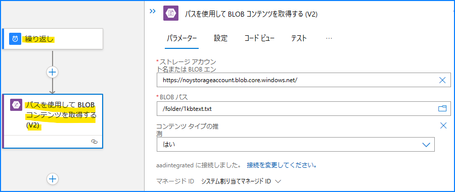
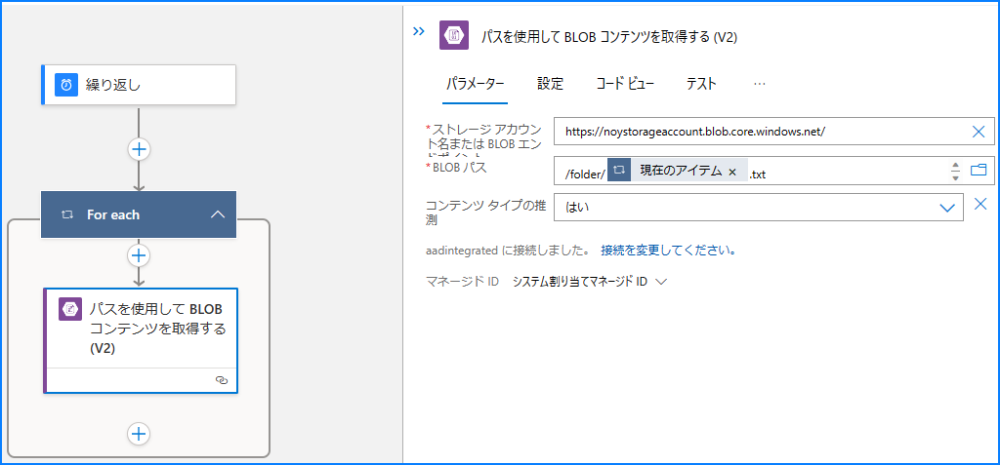

こんにちは！  Azure Integration サポート チームの 山田 です。
今回は Azure Logic Apps をこれから使い始めようという方へ、「Azure Logic Apps とは何なのか」「何ができるのか」を効率よく理解できるリソースを厳選し、リンク集としてご紹介いたします。

<!-- more -->

## こんな方におすすめです

従量課金版 Logic Apps、Standard 版 Logic Apps 合わせて、これから Azure Logic Apps を使い始めたいという方。

## 目次

- Azure Logic Apps とは
- コネクタとは
- ワークフローとは
- Standard 版 (シングルテナント) Logic Apps とは
- 制約と構成
- 価格
- 関連ドキュメント
- まとめ

## Azure Logic Apps とは

[概要 - Azure Logic Apps | Microsoft Learn](https://learn.microsoft.com/ja-jp/azure/logic-apps/logic-apps-overview)

>Azure Logic Apps はクラウド プラットフォームであり、コードをほとんど、またはまったく使用せずに、自動化されたワークフローを作成して実行できます。 ビジュアル デザイナーを使用し、事前構築済みの操作から選択することで、アプリ、データ、サービス、システムを統合および管理するワークフローをすばやく構築できます。

>Azure Logic Apps を使用すると、クラウド、オンプレミス、ハイブリッド環境の間でレガシ、最新、最先端のシステムを接続する方法が簡素化され、企業のシナリオと企業間 (B2B) シナリオ向けに高度にスケーラブルな統合ソリューションを開発するための、コードの記述がほとんど必要ない手段が提供されます。

引用: [Azure での基本的なエンタープライズ統合 - Azure Architecture Center | Microsoft Learn](https://learn.microsoft.com/ja-jp/azure/architecture/reference-architectures/enterprise-integration/basic-enterprise-integration)

引用: [概要 # さまざまな環境を作成してデプロイする - Azure Logic Apps | Microsoft Learn](https://learn.microsoft.com/ja-jp/azure/logic-apps/logic-apps-overview#create-and-deploy-to-different-environments)

### 従量課金版 (Consumption、マルチテナント) Logic Apps

> 1 つのロジック アプリではワークフローを 1 つだけ 使用できます。
"複数の Azure Active Directory テナントにわたる" ロジック アプリで、同じ処理 (コンピューティング)、ストレージ、ネットワークなどが共有されます。
冗長性のために、データはペア リージョンにレプリケートされます。 高可用性を実現するために、geo 冗長ストレージ (GRS) が有効になっています。

メリットについて以下となります。
> - 最も簡単に開始できる
> - 従量課金制
> - フル マネージド

### Standard 版 (シングルテナント) Logic Apps 

> 1 つのロジック アプリに、複数の "ステートフル" と "ステートレス" のワークフローを含めることができます。
"1 つのロジック アプリとテナント" のワークフローでは、同じ処理 (コンピューティング)、ストレージ、ネットワークなどが共有されます。
データはロジック アプリをデプロイしたのと同じリージョンに残ります。

メリットについて以下となります。
> - シングルテナント Azure Logic Apps ランタイムを使用して実行します。 デプロイ スロットは現在サポートされていません。
> - 大規模なスループット向上とコスト削減を実現するための追加の組み込みコネクタ
> - ランタイムとパフォーマンスの設定に関する制御と微調整機能の強化
> - 仮想ネットワークとプライベート エンドポイントに対する統合サポート。
> - 独自の組み込みコネクタの作成。

## コネクタとは

[コネクタの概要 | Microsoft Learn](https://learn.microsoft.com/ja-jp/connectors/connectors#connector-components)

> 各コネクタは、アクションとトリガーに分類される一連の操作を提供します。 基盤となるサービスに接続すると、アプリやワークフロー内でこれらの操作を簡単に活用することができます。

> アクションを使用して SQL データベース内のデータを検索、書き込み、更新、削除します。 

> いくつかのコネクタは、特定のイベントが発生したときにアプリに通知できるトリガーを提供しています。 

以下は 「繰り返し」 トリガー と 「パスを使用して BLOB コンテンツを取得する (V2)」 アクション の例です。

参考: [ワークフローから Azure Blob Storage に接続する - Azure Logic Apps | Microsoft Learn](https://learn.microsoft.com/ja-jp/azure/connectors/connectors-create-api-azureblobstorage?tabs=consumption#add-a-blob-action)

以下からコネクタの一覧をご覧いただけます。

[Azure Logic Apps コネクタのドキュメント - Connectors | Microsoft Learn](https://learn.microsoft.com/ja-jp/connectors/)

[すべての Logic Apps コネクタの一覧 | Microsoft Learn](https://learn.microsoft.com/ja-jp/connectors/connector-reference/connector-reference-logicapps-connectors)

## ワークフローとは

ワークフロー内にて、アクションを条件に基づいて制御したり、繰り返し処理したりできます。また、式関数を用いて出力結果から値を加工して利用できます。

### 制御

[ワークフローに条件を追加する - Azure Logic Apps | Microsoft Learn](https://learn.microsoft.com/ja-jp/azure/logic-apps/logic-apps-control-flow-conditional-statement?tabs=consumption)

[スイッチ アクションをワークフローに追加する - Azure Logic Apps | Microsoft Learn](https://learn.microsoft.com/ja-jp/azure/logic-apps/logic-apps-control-flow-switch-statement)

[アクションを繰り返すループを追加する - Azure Logic Apps | Microsoft Learn](https://learn.microsoft.com/ja-jp/azure/logic-apps/logic-apps-control-flow-loops?tabs=consumption)

### 式関数

[式関数のリファレンス ガイド - Azure Logic Apps | Microsoft Learn](https://learn.microsoft.com/ja-jp/azure/logic-apps/workflow-definition-language-functions-reference)

[Azure Logic Apps で JSON オブジェクトから特定のプロパティの値を取得する方法 | Japan Azure Integration Support Blog](https://jpazinteg.github.io/blog/LogicApps/how-to-treat-json-in-logicApps/)

[データの操作の実行 - Azure Logic Apps | Microsoft Learn](https://learn.microsoft.com/ja-jp/azure/logic-apps/logic-apps-perform-data-operations?tabs=consumption)

## Standard 版 (シングルテナント) Logic Apps とは

ここまでの内容に加えて、Standard 版 Logic Apps には以下のような特長がございます。

[Azure Logic Apps でのシングルテナントとマルチテナントの比較 - Azure Logic Apps | Microsoft Learn](https://learn.microsoft.com/ja-jp/azure/logic-apps/single-tenant-overview-compare#standard-logic-app-and-workflow)

> Standard ロジック アプリとワークフローには、再設計されたシングルテナント Azure Logic Apps ランタイムが使用されています。 このランタイムには Azure Functions 機能拡張モデルが使用されており、Azure Functions ランタイムの拡張機能としてホストされます。 この設計により、ロジック アプリ ワークフローの移植性、柔軟性、パフォーマンス向上に加え、Azure Functions プラットフォームと Azure App Service エコシステムから継承されたその他の機能と利点が提供されます。 

[ステートフルおよびステートレス ワークフロー](https://learn.microsoft.com/ja-jp/azure/logic-apps/single-tenant-overview-compare#stateful-stateless)

> ステートフル ワークフローでは、サービス停止が発生した場合に高い回復性を実現できます。 サービスとシステムが復元された後に、中断された実行を保存済みの状態から再構築し、ワークフローを再実行して完了することができます。 ステートフル ワークフローは、ステートレス ワークフローよりもはるかに長い間実行を継続できます。

> 各実行が完了した後に外部ストレージに前のイベントのデータを保持、確認、参照する必要がない場合は、ステートレス ワークフローを作成します。 これらのワークフローでは、各アクションとその状態の入出力を外部ストレージにではなく、"メモリ内にのみ" 保存します。 その結果、ステートレス ワークフローでは、実行時間が短縮され (通常は 5 分未満)、パフォーマンスが高速化されて応答時間が短くなり、スループットが向上し、実行コストが削減されます。

[Standard ワークフローと仮想ネットワーク間のトラフィックをセキュリティで保護する - Azure Logic Apps | Microsoft Learn](https://learn.microsoft.com/ja-jp/azure/logic-apps/secure-single-tenant-workflow-virtual-network-private-endpoint)

> Standard ロジック アプリのワークフローと Azure 仮想ネットワーク間で安全かつプライベートに通信するために、受信トラフィック用に "プライベート エンドポイント" を設定し、送信トラフィック用に仮想ネットワーク統合を使用できます。

## 制約と構成

Logic Apps を利用するうえで知っておきたい制約事項です。

[制約と構成の参考ガイド - Azure Logic Apps | Microsoft Learn](https://learn.microsoft.com/ja-jp/azure/logic-apps/logic-apps-limits-and-config?tabs=consumption%2Cazure-portal)

## 価格

最後に、Logic Apps の利用価格です。

[価格 - Logic Apps | Microsoft Azure](https://azure.microsoft.com/ja-jp/pricing/details/logic-apps/)

## 関連ドキュメント

ほか Logic Apps を学べるリソースには、以下のようなものがございます。

- Training
    - [Azure Logic Apps でデータとアプリを統合するための自動化されたワークフローを構築する - Training | Microsoft Learn](https://learn.microsoft.com/ja-jp/training/paths/build-workflows-with-logic-apps/)
    - [Azure Logic Apps の概要 - Training | Microsoft Learn](https://learn.microsoft.com/ja-jp/training/modules/intro-to-logic-apps/)
    - [Azure Logic Apps を使用してデータを自動的にルートし、処理する - Training | Microsoft Learn](https://learn.microsoft.com/ja-jp/training/modules/route-and-process-data-logic-apps/)
    - [カスタム コネクタを使用して Azure Logic Apps ワークフローから API を呼び出す - Training | Microsoft Learn](https://learn.microsoft.com/ja-jp/training/modules/logic-apps-and-custom-connectors/)
    - [Azure Resource Manager テンプレートを使用して Azure Logic Apps ワークフローを作成し、デプロイする - Training | Microsoft Learn](https://learn.microsoft.com/ja-jp/training/modules/create-deploy-logic-apps-using-arm-templates/)
- Blog
    - [Japan Azure Integration Support Blog](https://jpazinteg.github.io/blog/index.html)

## まとめ

本記事では、Azure Logic Apps をこれから使い始めようという方へ、「Azure Logic Apps とは何なのか」「何ができるのか」を効率よく理解できるリソースを一挙にご紹介いたしました。引き続き、皆様のお役に立てる情報を発信してまいります。

