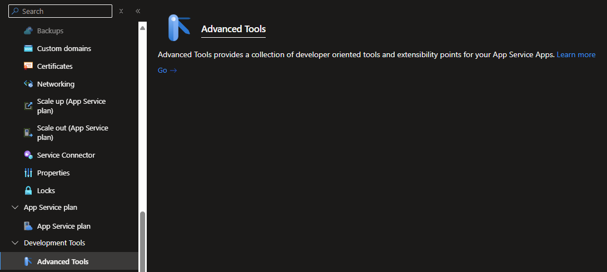
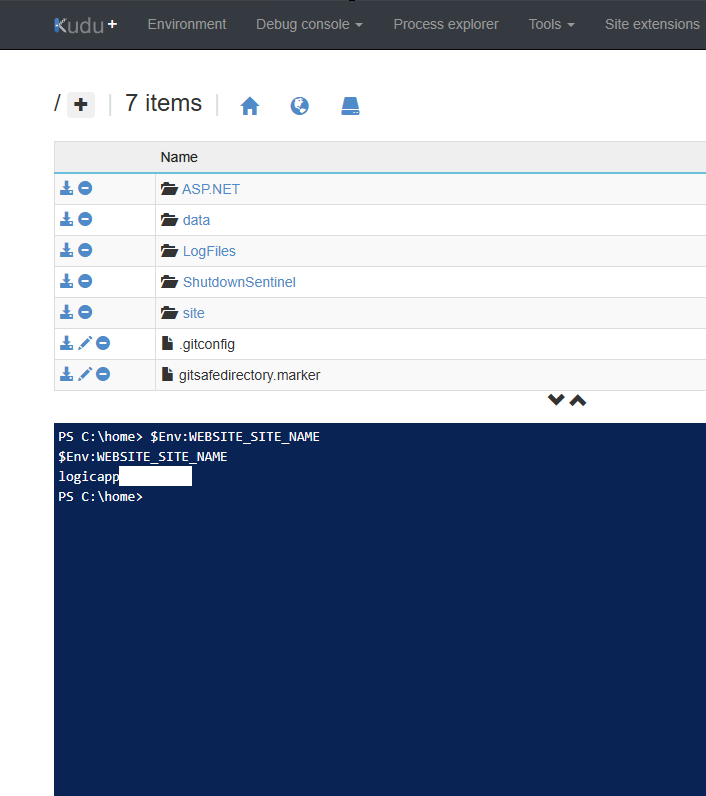
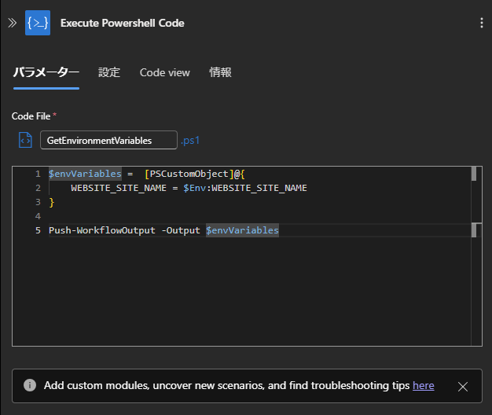
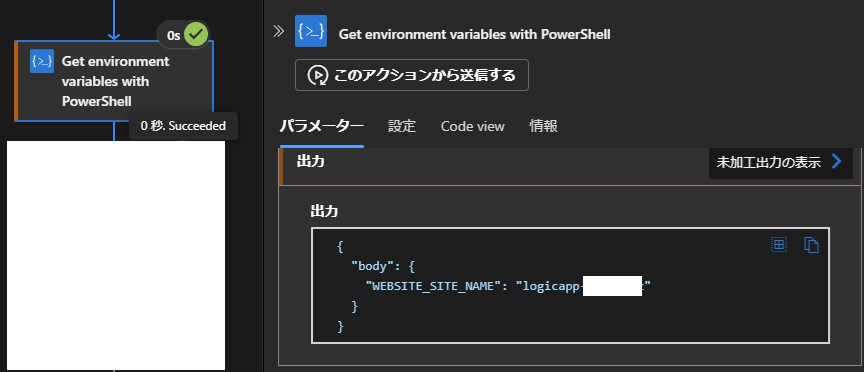

Azure Integration サポート チームの長坂です。<br>
Azure Logic Apps Standard は内部で Azure App Services をホスティングリソースとして活用しており、今回はその仕組みを応用したテクニックをご紹介いたします。

<!-- more -->

## 目次

1. [Azure Logic Apps Standard のホスト環境](#header1)
2. [Kudu](#header2)
3. [アクションで OS 情報を取得する一例](#header3)
4. [まとめ](#header4)

<h2 id="header1">1. Azure Logic Apps Standard のホスト環境</h2>

Azure Logic Apps Standard (シングルテナント) は、ホスト環境を独自に指定する場合を除いて基本的には App Service プラン上で動作します。<br>
[ロジック アプリ ワークフローの種類と環境](https://learn.microsoft.com/ja-jp/azure/logic-apps/single-tenant-overview-compare) で各ホスティングプランとリソース構成を確認することができます。

Logic Apps のホストである App Service に対して後述する Kudu や CLI を使用することで OS 情報を取得することができます。

<h2 id="header2">2. Kudu</h2>

Azure App Service では GUI から CMD や PowerShell のコマンド実行画面を表示することができる `Kudu` というサービスが提供されております。<br>
App Service でホストされた Logic Apps Standard でも、Kudu を使用して自身が動作する OS 上でコマンドを実行することができます。<br>
[Kudu サービスの概要 - Azure App Service | Microsoft Learn](https://learn.microsoft.com/ja-jp/azure/app-service/resources-kudu)

2025 年 2 月時点では以下の画面から Kudu を開くことができます。<br>

- Azure Portal > Logic Apps リソース > Development tools -
  Advanced Tools > `Go→` のリンク
  

画面上部の `Debug console` から CMD と PowerShell を選択できます。
一例として PowerShell で環境変数の値を取得する様子を以下に記載します。

```powershell
$Env:WEBSITE_SITE_NAME
```

上記を実行すると、Logic Apps のリソース名が表示されます。


App Service の OS ではその他に様々な環境変数が存在しており、状況に応じて必要な値が設定された環境変数を取得してワークフロー内のアクションで活用することができます。<br>
[環境変数とアプリ設定のリファレンス - Azure App Service | Microsoft Learn](https://learn.microsoft.com/ja-jp/azure/app-service/reference-app-settings?tabs=kudu%2Cdotnet)

このように、OS 情報を取得することが可能です。

<h2 id="header3">3. アクションで OS 情報を取得する一例</h2>

PowerShell で環境変数を取得できるということは、同様にワークフロー内の `Execute Powershell Code` アクションでも取得が可能ということです。<br>
`Execute Powershell Code` アクションの使い方や制限事項等の説明は以下のドキュメントに記載されております。<br>
[Standard ワークフローで PowerShell を追加して実行する - Azure Logic Apps | Microsoft Learn](https://learn.microsoft.com/ja-jp/azure/logic-apps/add-run-powershell-scripts)

ワークフローに出力を返し、後続のアクションで取得した環境変数の値を使用するには上記にも記載の通り、`Push-WorkflowOutput` を使います。

> ワークフローに出力を返すには、[Push-WorkflowOutput コマンドレット](https://learn.microsoft.com/ja-jp/azure/logic-apps/add-run-powershell-scripts#push-workflowoutput)を使う必要があります。

```powershell
$envVariables =  [PSCustomObject]@{
    WEBSITE_SITE_NAME = $Env:WEBSITE_SITE_NAME
}

Push-WorkflowOutput -Output $envVariables
```



アクションが成功すると、このように JSON で出力が返されます。


ワークフローに返した出力は `Parse JSON` アクション等を使用することで、動的コンテンツで取り扱える形式の値とすることが可能になり、より柔軟性が向上します。<br>
[JSON の解析アクション](https://learn.microsoft.com/ja-jp/azure/logic-apps/logic-apps-perform-data-operations?tabs=consumption#parse-json-action)

<h2 id="header4">4. まとめ</h2>

本記事では、Azure Logic Apps Standard がホストされた App Service の OS 環境変数を取得してワークフロー内で使用する方法をご紹介しました。

同様の手法で環境変数以外の OS 情報を取得して使用することが可能であるため、ホスト環境である App Service に対する理解を深めた上でご紹介した方法を活用することで、より幅広い応用が可能になるかと存じます。

ただし、この方法はあくまで Azure Logic Apps Standard 内部の仕組みを応用したものであり、Azure Logic Apps の標準の機能として提供されるものではありません。<br>
したがって、すべての OS の情報が同じ方法で取得できるとは限らず、将来に渡って同じ手段が使い続けられる保証はありません。<br>
あくまで試行ベースで得られた結果を活用する方法であるということをご認識の上参考にしていただきますようお願いいたします。

皆様の開発のご参考になれば幸いです。

---

2024 年 7 月 18 日時点の内容となります。
本記事の内容は予告なく変更される場合がありますので予めご了承ください。

---
