こんにちは！Azure Integration サポート チームの 川合 です。  

お客様環境の Logic Apps にて障害や何らかの問題が発生した際に、本テクニカル サポートとしましてお客様にログの採取をお願いする場合がございます。
今回は、取得いただきたいログの内容と、その取得方法についてご案内申し上げます。

<!-- more -->

## 目次
- 前提条件
- 従量課金タイプの場合
- Standard タイプの場合
- その他関連ログ
- まとめ

## 前提条件
まず、本 Logic Apps 製品のお問合せをいただく場合、Azure Portal にログインいただいたうえで、事象の発生しているサブスクリプションからお問合せいただきますようお願いいたします。
Unified 契約や Azure 製品のサポート受けられる適切なサポート契約をお持ちの場合でも、M365 管理ポータルや直接電話でのお問合せなど Azure Portal 以外からお問合せいただくと詳細な調査が出来ませんので、その際は別途 Azure Portal からお問合せいただくようお願いさせていただく場合がございます。
また、弊社にて詳細ログを調査するためには事象発生から 28 日以内にログを提供いただきますようお願いいたします。28 日を経過すると詳細な調査が出来ない場合がございますのでで予めご留意ください。

## 従量課金タイプの場合
従量課金タイプの場合、以下の情報についてご提供をお願いいたします。

1. 当該 Azure のサブスクリプション ID
2. 当該ロジック アプリのリソース情報
3. 当該ロジック アプリの識別子
4. 当該ロジック アプリの実行時間
5. 当該ロジック アプリの入出力のスクリーンショット
6. 当該ロジック アプリの未加工入出力
7. 当該ロジック アプリのコードビュー

それでは取得方法についてご案内申し上げます。

### 1．当該 Azure のサブスクリプション ID
<u>**提供方法：テキスト形式**</u>
当該 Azure のサブスクリプション ID については、[Azure ポータル] - [Logic Apps] - [<対象の Logic App>] より、概要欄のサブスクリプション ID をご確認下さい。
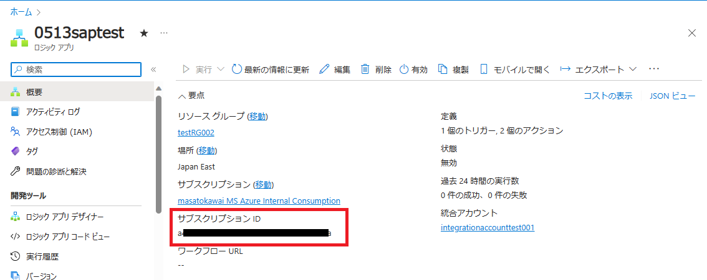

### 2．当該ロジック アプリのリソース情報
<u>**提供方法：テキスト形式**</u>
当該のリソース ID については、[Azure ポータル] - [Logic Apps] - [<対象の Logic App>] - [設定 - プロパティ] に遷移いただき「リソース ID」に設定されているリソース ID をご確認下さい。

### 3. 当該ロジック アプリの識別子
<u>**提供方法：テキスト形式**</u>
当該ロジック アプリの識別子については、[Azure ポータル] - [Logic Apps] - [<対象の Logic App>] - [概要] よりエラーの発生した実行履歴の [識別子] をご確認下さい。
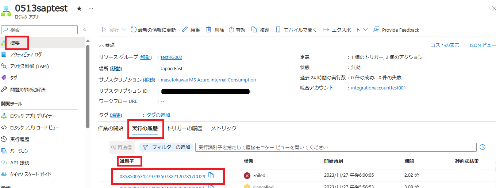

### 4. 当該ロジック アプリの実行時間
<u>**提供方法：テキスト形式**</u>
当該ロジック アプリの実行時間については、[Azure ポータル] - [Logic Apps] - [<対象の Logic App>] - [概要] よりエラーの発生した実行履歴の [開始時間] をご確認下さい。
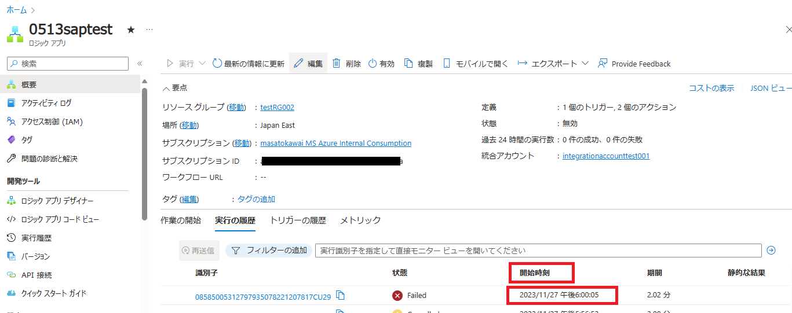

### 5. 当該ロジック アプリの入出力のスクリーンショット
<u>**提供方法：イメージ形式**</u>
当該ロジック アプリの入出力のスクリーンショットについては、[Azure ポータル] - [Logic Apps] - [<対象の Logic App>] - [概要] よりエラーの発生した実行履歴を選択し、[ロジック アプリの実行] にて対象のアクションを展開いただき、対象アクションの入力と出力が表示されているスクリーンショットを取得します。アクションの全体が分かるように取得いただきますようお願いします。

例 1
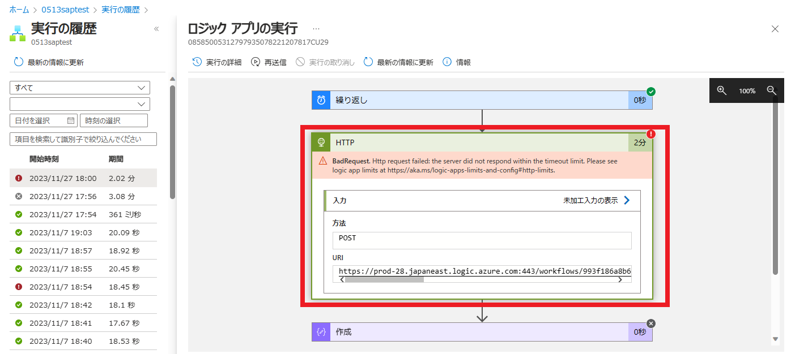

例 2
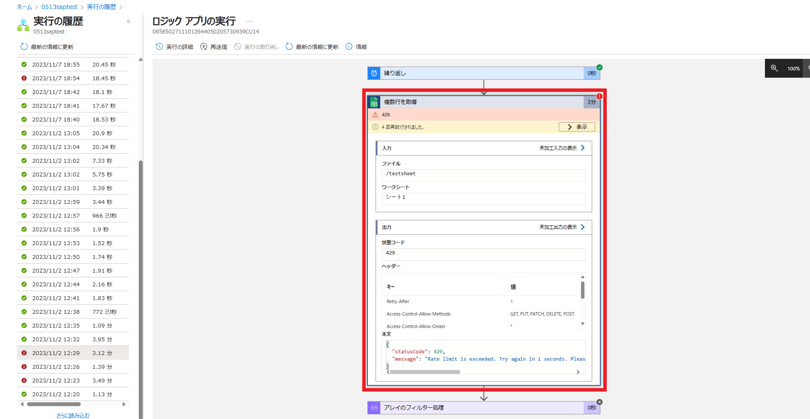

例 3

### 6. 当該ロジック アプリの未加工入出力
<u>**提供方法：テキスト形式**</u>
当該ロジック アプリの未加工入出力については、[Azure ポータル] - [Logic Apps] - [<対象の Logic App>] - [概要] よりエラーの発生した実行履歴を選択し、[ロジック アプリの実行] にて対象のアクションを展開いただき、対象アクションの入力及び出力にて [未加工入力の表示]、[未加工出力の表示] を押下いただき出力されるテキストの内容をご確認下さい。未加工出力が存在していない場合、その旨をご連絡ください。

・未加工入力の表示（未加工出力の表示がある場合はそちらも）のリンクを選択します。
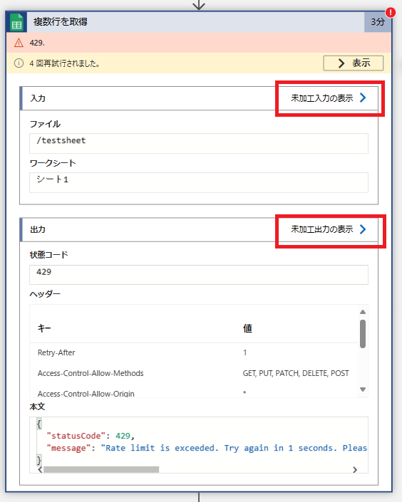

・表示されているテキストの情報を全てコピーしてテキストファイルなどに貼り付けます。

### 7. 当該ロジック アプリのコードビュー
<u>**提供方法：テキスト形式**</u>
当該ロジック アプリのコードビューについて、[Azure ポータル] - [Logic Apps] - [<対象の Logic App>] - [開発ツール - ロジック アプリ コード ビュー] にて表示されますコード全文をご確認下さい。
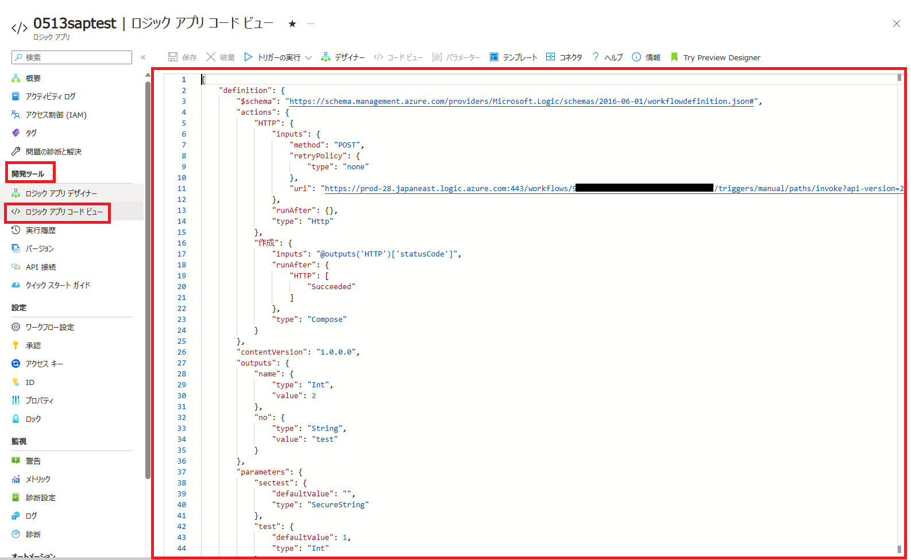

以上を取得できましたら、弊社サポート エンジニアより連携させていただきます ファイル アップロード サイトにログをアップロード頂きますようお願いいたします。
従量課金タイプのログ取得については以上となります。

続いて、Standard タイプの Logic Apps に関するログの提供依頼についてご案内申し上げます。

## Standard タイプの場合
Standard タイプの場合、以下の情報についてご提供をお願いいたします。
ただし、Standard タイプの場合はステートフルのワークフローを利用しているとログが出力されませんので予めご留意ください。

1. 当該 Azure のサブスクリプション ID
2. 当該ロジック アプリのリソース情報
3. 当該ロジック アプリの識別子
4. 当該ロジック アプリの実行時間
5. 当該ロジック アプリの入出力のスクリーンショット
6. 当該ロジック アプリの未加工入出力
7. 当該ロジック アプリのコードビュー

それでは取得方法についてご案内申し上げます。

### 1．当該 Azure のサブスクリプション ID
<u>**提供方法：テキスト形式**</u>
当該 Azure のサブスクリプション ID については、[Azure ポータル] - [Logic Apps] - [<対象の Logic App>] より、概要欄のサブスクリプション ID をご確認下さい。

### 2．当該ロジック アプリのリソース情報
<u>**提供方法：テキスト形式**</u>
当該のリソース ID については、[Azure ポータル] - [Logic Apps] - [<対象の Logic App>] - [設定 - プロパティ] に遷移いただき「リソース ID」に設定されているリソース ID をご確認下さい。
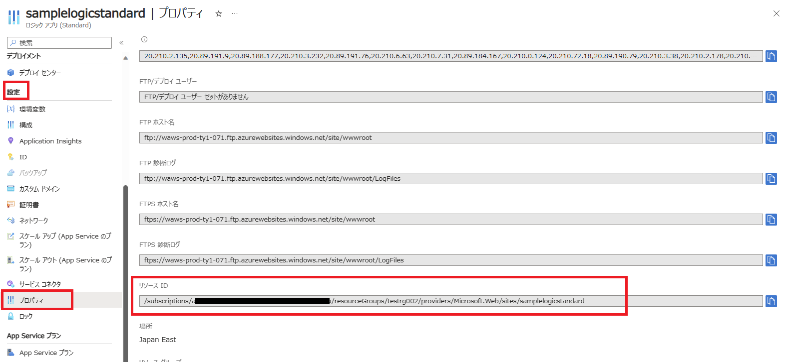

### 3. 当該ロジック アプリの識別子
<u>**提供方法：テキスト形式**</u>
当該ロジック アプリの識別子については、 [Azure ポータル] - [Logic Apps] - [<対象の Logic App>] - [ワークフロー - ワークフロー] - [<対象の ワークフロー>] よりエラーの発生した実行履歴の [識別子] をご確認下さい。

### 4. 当該ロジック アプリの実行時間
<u>**提供方法：テキスト形式**</u>
当該ロジック アプリの実行時間については、[Azure ポータル] - [Logic Apps] - [<対象の Logic App>] - [ワークフロー - ワークフロー] - [<対象の ワークフロー>] よりエラーの発生した実行履歴の [開始時間] をご確認下さい。

### 5. 当該ロジック アプリの入出力のスクリーンショット
<u>**提供方法：イメージ形式**</u>
当該ロジック アプリの入出力のスクリーンショットについては、[Azure ポータル] - [Logic Apps] - [<対象の Logic App>] - [ワークフロー - ワークフロー] - [<対象の ワークフロー>] よりエラーの発生した実行履歴を選択し、対象のアクションを展開いただき、対象アクションの入力と出力が表示されているスクリーンショットを取得します。画面の下部に見切れている部分も含めて、アクションの全体が分かるように取得いただきますようお願いします。

例 1
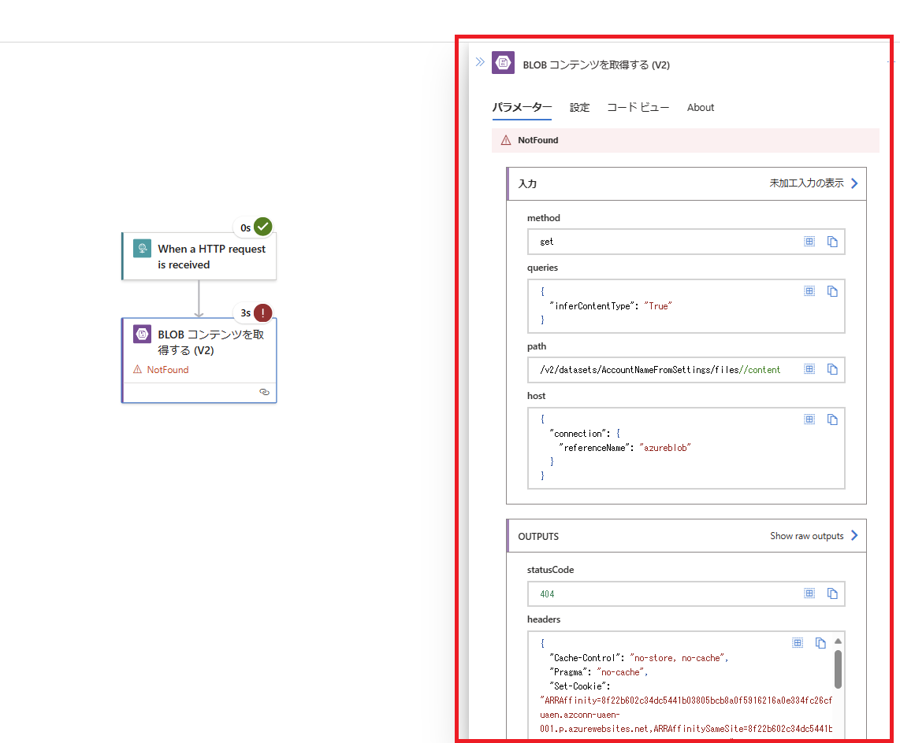

例 2
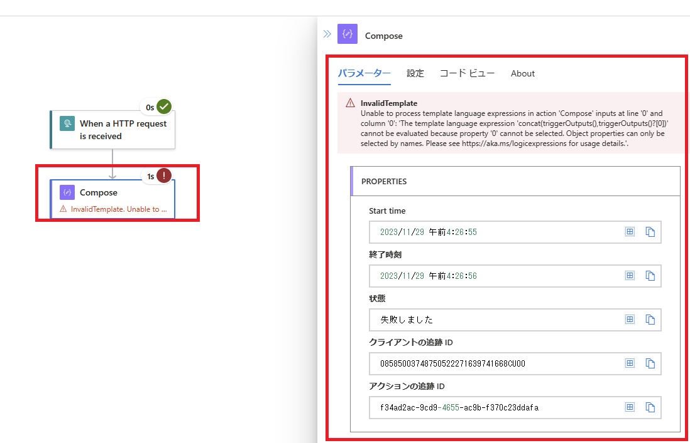

### 6. 当該ロジック アプリの未加工入出力
<u>**提供方法：テキスト形式**</u>
当該ロジック アプリの未加工入出力については、[Azure ポータル] - [Logic Apps] - [<対象の Logic App>] - [ワークフロー - ワークフロー] - [<対象の ワークフロー>] よりエラーの発生した実行履歴を選択し、対象のアクションを展開いただき、対象アクションの入力及び出力にて [未加工入力の表示]、[未加工出力の表示] を押下いただき出力されるテキストの内容をご確認下さい。未加工出力が存在していない場合、その旨をご連絡ください。

・未加工入力の表示（未加工出力の表示がある場合はそちらも）のリンクを選択します。
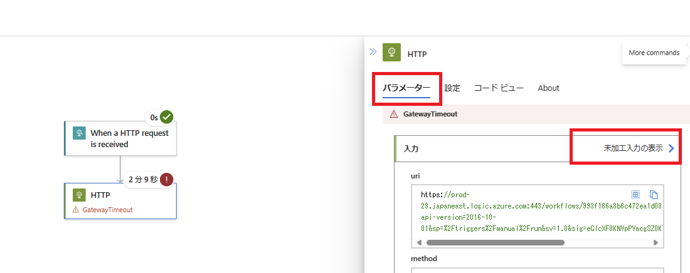

・表示されているテキストの情報を全てコピーしてテキスト ファイルなどに貼り付けます。
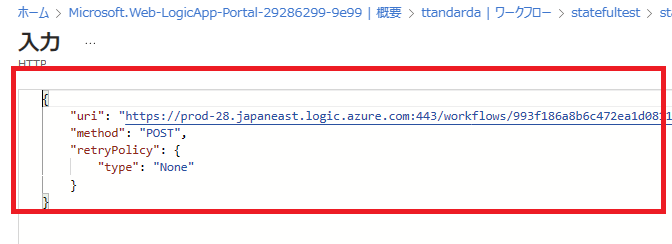

### 7. 当該ロジック アプリのコンテンツ
<u>**提供方法：圧縮ファイル形式**</u>
当該ロジック アプリのコンテンツについては、[Azure ポータル] - [Logic Apps] - [<対象の Logic App>] - [概要] - [アプリ コンテンツのダウンロード]より、アプリ設定を含めたコンテンツ一式の圧縮ファイルを提供下さい。

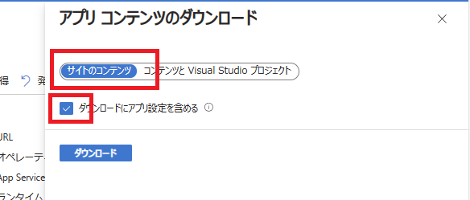

## その他関連ログ
必要に応じて、お客様のブラウザの操作における HAR ファイルや Standard Logic Apps のネットワーク キャプチャを取得いただく場合がございます。
その際の取得方法について、以下に記載いたしますので参考までにご確認下さい。

### HAR ファイルの取得依頼
<u>**提供方法：har 拡張子の形式**</u>

1. Microsoft Edge を起動します。

2. [F12] キーを押下し、表示されるペイン内にて、[Network] タブに移動して、データをキャプチャーしていることを確認します。
※ 以下のように、赤い丸が表示されておりましたら、キャプチャーが開始されております。
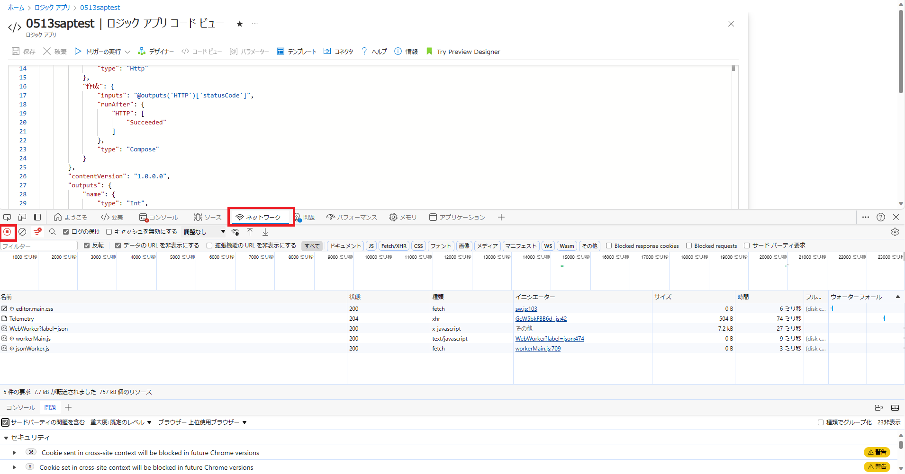

3. [ログの保持 (もしくは Preserve log) ] にチェックを入れます。その後、以下のボタンをクリックして、現在のログを削除します。
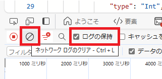

4. 今回事象の発生している動作や、弊社サポートより連携させていただいた操作を実施し、結果を確認します。

5. [Network] タブに戻り、[Export HAR] をクリックします。

エクスポートした HAR ファイルを弊社までお寄せください。

### Standard Logic Apps のパケットキャプチャ
<u>**提供方法：圧縮ファイル形式**</u>

1. 以下のサイトより、「使ってみる」ボタンを押下し、事象の発生している Standard Logic Apps を参照可能なユーザーでサインインします。
[Web Apps - Start Network Trace](https://learn.microsoft.com/ja-jp/rest/api/appservice/web-apps/start-network-trace?tabs=HTTP)
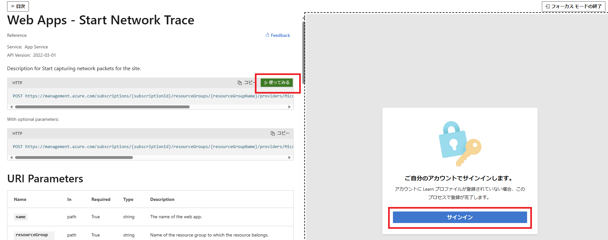

2. ネットワーク キャプチャの採取を開始します。設定項目については公開情報にも記載がございますが以下の通りとなります。
設定できましたら、画面下部の「実行」ボタンを押下します。

・name : Standard Logic Apps の名前
・resourceGroupName : Standard Logic Apps が存在するリソース グループ名
・subscriptionId : Standard Logic Apps が存在するサブスクリプション ID
・api-version : 変更なし
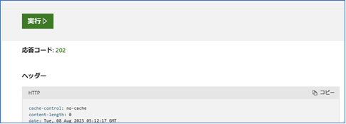

3. 対象の Standard Logic Apps を開き、ワークフローを実行して事象を再現します。

4. ワークフローの実行が完了しましたら、以下のサイトより、「使ってみる」ボタンを押下し、ネットワーク キャプチャの採取を終了します。こちらも設定項目は同様でございます。
[Web Apps - Stop Network Trace](https://learn.microsoft.com/ja-JP/rest/api/appservice/web-apps/stop-network-trace?tabs=HTTP)

5. ネットワーク キャプチャを取得します。
[ロジック アプリ] - [<対象の ロジック アプリ>] - [開発ツール - 高度なツール] と遷移し、「移動」ボタンを押下して Kudu を開きます。
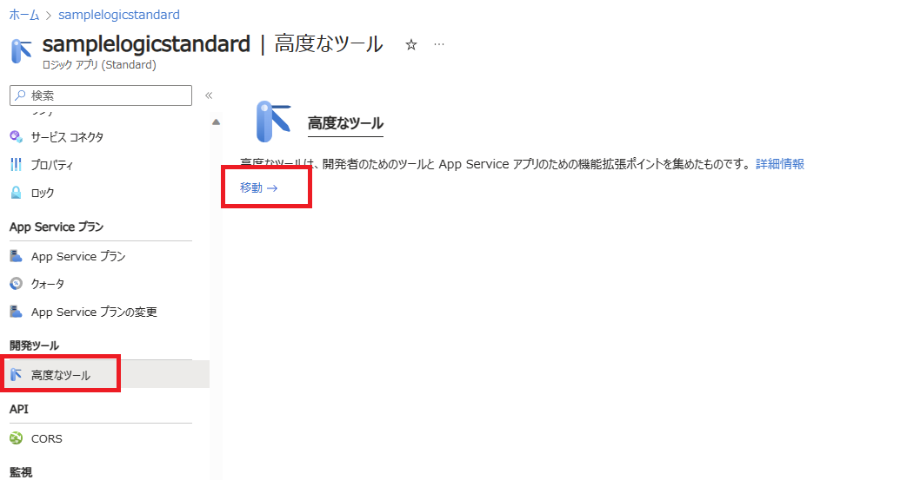

6. Kudu にログインできましたら、画面上部より「Debug console > CMD」を選択します。
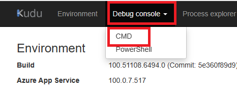

7. 停止いただくと、以下の通り / LogFiles / networktrace 内に Zip ファイルが生成されますので、出力されたファイル全てダウンロードします。

8. ファイルのダウンロードは以下の通り画面左のダウンロード アイコンからお願いいたします。

ダウンロードした圧縮ファイルを弊社までお寄せください。

なお、上記でご案内いたしましたログについては、テキスト ファイルに個別に分割いただいても構いませんし、Excel ファイルにまとめていただいても結構でございますが、Word ファイルにまとめられると容量の都合上内容を確認出来ない場合がございますので、可能な限り Word での提供は避けていただけると幸いでございます。

## まとめ
本記事では、以下についてご案内いたしました。Logic Apps の調査をご依頼の際はこちらの内容を基に本テクニカルサポートへお問合せいただければと思います。
- 前提条件
- 従量課金タイプの場合
- Standard タイプの場合
- その他関連ログ
- まとめ

最後までお読みいただき、ありがとうございました！

<Azure Logic Apps の参考サイト>
-- 概要 - Azure Logic Apps とは
https://learn.microsoft.com/ja-jp/azure/logic-apps/logic-apps-overview
Azure Logic Apps とは、ロジック アプリ デザイナーでフロー チャートを用いて作成したワークフローを自動実行するソリューションです。
Azure Logic Apps では、条件分岐などを実装することができ、ワークフローの実行状況に応じて実行する処理を分岐することが可能です。
