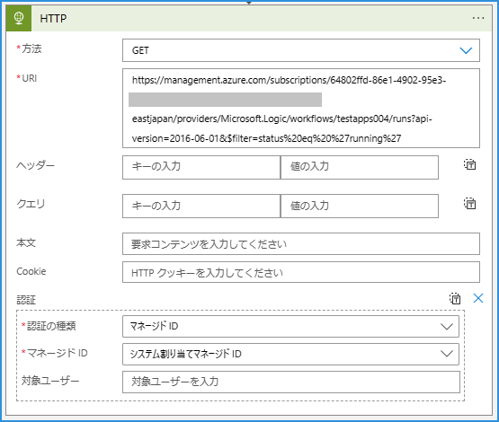
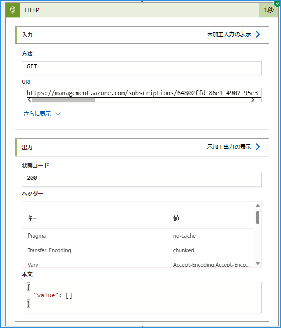
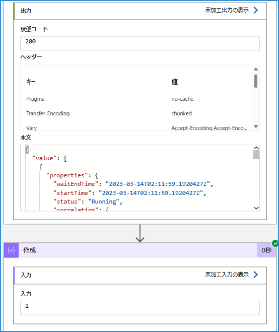

こんにちは！Azure Integration サポート チームの山田です。

複数の Logic Apps を実行する際に、「[トリガーのコンカレンシー制御](https://jpazinteg.github.io/blog/LogicApps/triggerConcurrency/)」がございますが、ここではもう少し汎用的に、既に実行中の Logic Apps の状況を確認して制御する方法についてご紹介いたします。

<!-- more -->

## こんな方におすすめです

トリガーのコンカレンシー制御以外の手段で、他の実行中の Logic Apps の状況を任意にフィルターして制御する方法を実装されたい方。

## 目次
- 実行一覧 API
- Logic Apps から HTTP コネクタによる API の実行
- 状況判定
- 関連ドキュメント
- まとめ

## 実行一覧 API

[Workflow Runs - List](https://learn.microsoft.com/ja-jp/rest/api/logic/workflow-runs/list?tabs=HTTP)

ワークフローの実行の一覧を取得します。

`https://management.azure.com/subscriptions/{subscriptionId}/resourceGroups/{resourceGroupName}/providers/Microsoft.Logic/workflows/{workflowName}/runs?api-version=2016-06-01&$filter={$filter}`

これにより、Filter で例として、実行中のフローを絞り込むことができます。実行中のものを絞り込むフィルタは `status eq 'running'` などとなります。エンコードを掛けますと以下のような URL になります。

`https://management.azure.com/subscriptions/{subscriptionId}/resourceGroups/{resourceGroupName}/providers/Microsoft.Logic/workflows/{workflowName}/runs?api-version=2016-06-01&$filter=status%20eq%20%27running%27`

実行結果:

## Logic Apps から HTTP コネクタによる API の実行

上の API を、Logic Apps の、HTTP コネクタから実行いただけます。ここでは認証にマネージド ID を利用しております。

実行結果:

この方法で当該の API を使用する際は Logic Apps のマネージド ID に対して、「Logic App Operator」ロールを割り当てます。

[Azure 組み込みロール # Logic App Operator](https://learn.microsoft.com/ja-jp/azure/role-based-access-control/built-in-roles#logic-app-operator)

## 状況判定

この HTTP の結果に対して、Logic Apps 内で関数を用いますと以下のような判定が可能となります。

 

`Length(body('HTTP')?['value'])`

Length

https://learn.microsoft.com/ja-jp/azure/logic-apps/workflow-definition-language-functions-reference#length

配列の項目の数を返します。

実行結果:

 

この length 関数を用いて、実行中のジョブ一覧「body('HTTP')?['value']」の要素数をカウントします。

- カウントを条件ステートメントで判定する。
- 実行中のジョブが 1 以上である場合は終了アクションでジョブを終了する。
- 実行中のジョブがない場合は想定の処理に移行する。

例として、上のような制御が可能となります。

以上となります。

## 関連ドキュメント

ほか、トリガーに設定可能なコンカレンシー制御と最大実行待機数に関する情報については、以下の記事がございます。

- [トリガーのコンカレンシー制御と最大実行待機数について](https://jpazinteg.github.io/blog/LogicApps/triggerConcurrency/)  

## まとめ

本記事では、複数の Logic Apps を実行する際に、汎用的に、既に実行中の Logic Apps の状況を確認して制御する方法についてご紹介いたしました。本記事が皆様のお役に立ちましたら幸いです。