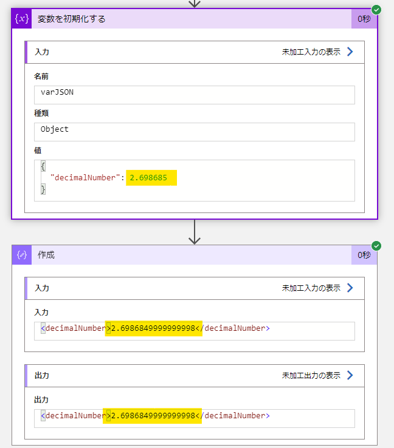
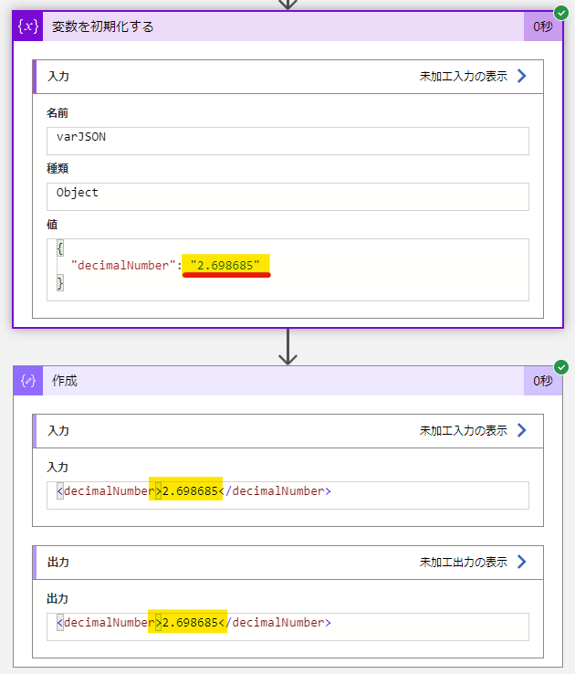

こんにちは。  Azure Integration サポート チームの継松です。  
Azure Logic Apps では式関数を使用し、ワークフローの実行中にアクションから取得した値の参照や処理を行うことができます。
今回は、式関数の 1 つである xml() の動作についてご紹介します。
特に、 10 進数の値が含まれる場合に生じる事象および事象の回避策についてご案内します。

<!-- more -->

## 目次
- xml() 関数について
- 10 進数の値を変換するときの動作について
- 事象の回避策について
- まとめ

## xml() 関数について

xml('<value>') では、JSON オブジェクトを含む文字列の XML バージョンを返します。

例
xml('<name>Sophia Owen</name>')

結果 : 
```xml
<name>Sophia Owen</name>
```

式関数のリファレンス ガイド - Azure Logic Apps | Microsoft Learn #xml
https://learn.microsoft.com/ja-jp/azure/logic-apps/workflow-definition-language-functions-reference#xml

## 10 進数の値を変換するときの動作について

以下に示す通り、この xml() 関数を使用して 10 進数の  JSON オブジェクトを含む値を変換すると、浮動小数点の精度に問題が生じる場合がございます。



こちらはこの xml() 関数で使用される以下のサード パーティの NewtonSoft パッケージによる既知の問題です。

JToken.ToObject(T) Method (JsonSerializer)
https://www.newtonsoft.com/json/help/html/M_Newtonsoft_Json_Linq_JToken_ToObject__1_1.htm

NewtonSoft は浮動小数点数を .NET double 型にロードします。これにより、浮動小数点を文字列に変換する際に精度の損失が生じます。

JsonSerializerSettings.FloatParseHandling Property
https://www.newtonsoft.com/json/help/html/P_Newtonsoft_Json_JsonSerializerSettings_FloatParseHandling.htm

## 事象の回避策について

現時点では、以下に示す通り、値を文字列として指定することで、事象を回避いただけます。




## まとめ

本記事では xml() 関数の動作および 10 進数の値を変換する場合の事象回避策についてご紹介いたしました。
他にも、便利な式関数が複数ご用意ございますので、下記の公開資料からご参照いただけますと幸いでございます。

式関数のリファレンス ガイド - Azure Logic Apps | Microsoft Learn
https://learn.microsoft.com/ja-jp/azure/logic-apps/workflow-definition-language-functions-reference


