こんにちは。Azure Integration サポート チームの髙橋です。

Azure Monitor でアラートが発報された時に Logic Apps を呼び出す方法について説明いたします。

<!-- more -->

## こんな方におすすめです
- ログ アラートやメトリック アラート発報時に、Logic Apps を起動したい方
- アクション グループで Logic Apps を選択されたい方

## Azure Monitor のアクション グループ
Azure Monitor ではアラート ルールを設定し、特定のリソースを監視することができます。
- 参考ドキュメント : [新しいアラート ルールを作成する](https://learn.microsoft.com/ja-jp/azure/azure-monitor/alerts/alerts-create-new-alert-rule?tabs=metric)

アラートが発報したことをトリガーに、Logic Apps を起動させることが可能です。
アクション グループで Logic Apps を選択します。
- 参考ドキュメント : [Azure Portal でのアクション グループの作成および管理](https://learn.microsoft.com/ja-jp/azure/azure-monitor/alerts/action-groups)

具体的な設定方法は、以下になります。

1. Logic Apps 側を作成する。
Logic Apps にて「HTTP 要求の受信時」トリガーを設定している必要があります。
「HTTP 要求の受信時」トリガーの詳細につきましては、以下の公開情報もございます。
- 参考ドキュメント : [Azure Logic Apps のワークフローに送信された受信 HTTPS 要求を処理する # Request トリガーの追加](https://learn.microsoft.com/ja-jp/azure/connectors/connectors-native-reqres?tabs=consumption#add-a-request-trigger)
また、アクション グループでは、従量課金タイプの Logic Apps と Standard Logic Apps の両方をご設定いただけます。
**<従量課金タイプ>**
「HTTP 要求の受信時」トリガーを設定いたします。
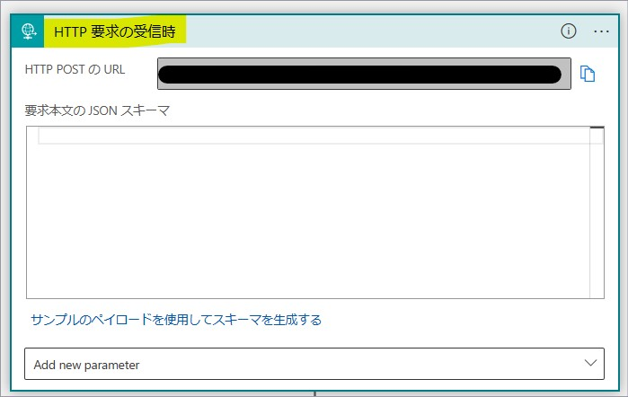
**<Standard タイプ>**
「Runtime」にて「アプリ内」にチェックを入れ、「Request」を選択いたします。
「When a HTTP request is received」トリガーを設定いたします。
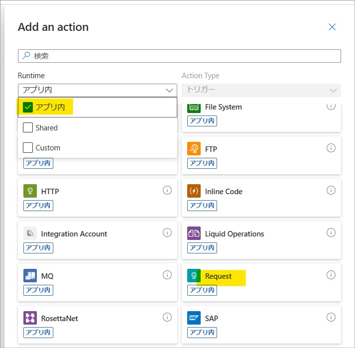

2. アクション グループを作成する。
[モニター] - [アラート] にて「アクション グループ」を選択します。
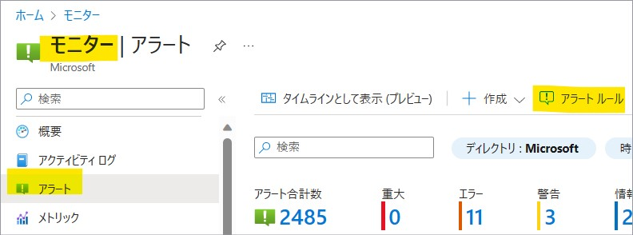
「 + 作成」を押下します。
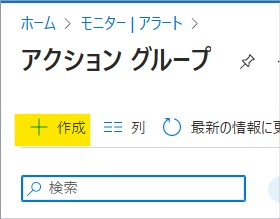
「基本」タブおよび「通知」タブを適宜設定し、「アクション」タブに遷移します。
「アクション タイプ」にて「ロジック アプリ」を選択します。
1 で作成した Logic Apps が存在するサブスクリプションおよびリソース グループをプルダウンで選択し、「ロジック アプリを選択します」にて対象の Logic Apps を選択します。
**<従量課金タイプ>**

**<Standard タイプ>**

残りの設定を適宜行い、アクション グループを作成いたします。

### テスト実行
実際のアラートを発報せずに、アクション グループのテストを行うことが可能です。
- 参考ドキュメント : [Azure Portal でのアクション グループの作成および管理 # Azureポータルでアクショングループをテストする。](https://learn.microsoft.com/ja-jp/azure/azure-monitor/alerts/action-groups#test-an-action-group-in-the-azure-portal)

先ほどの手順で作成したアクション グループの [概要] を開き、「テスト」を押下します。
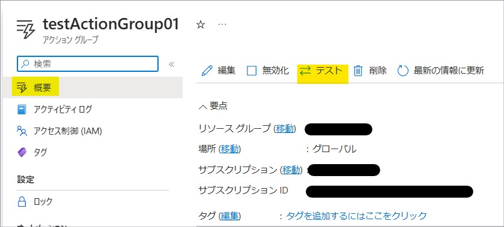

「サンプルの種類を選択」にて任意のアラートを選択し、「アクション タイプ」にてテストしたいアクションにチェックを入れ、「Test」ボタンを押下します。
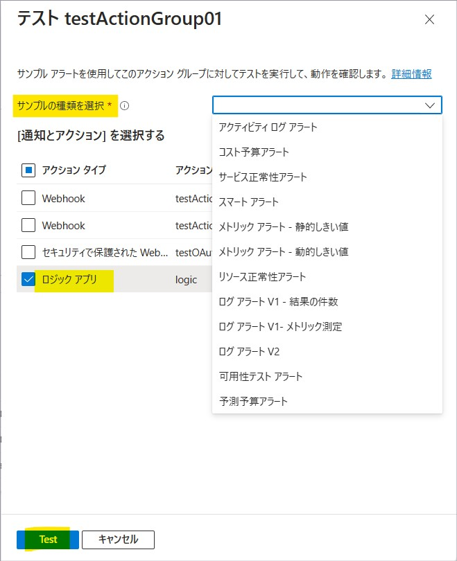

このとき利用されるスキーマは、共通アラート スキーマになります。
- 参考ドキュメント : [共通アラート スキーマ](https://learn.microsoft.com/ja-jp/azure/azure-monitor/alerts/alerts-common-schema)

以下はテストが成功した状態になります。
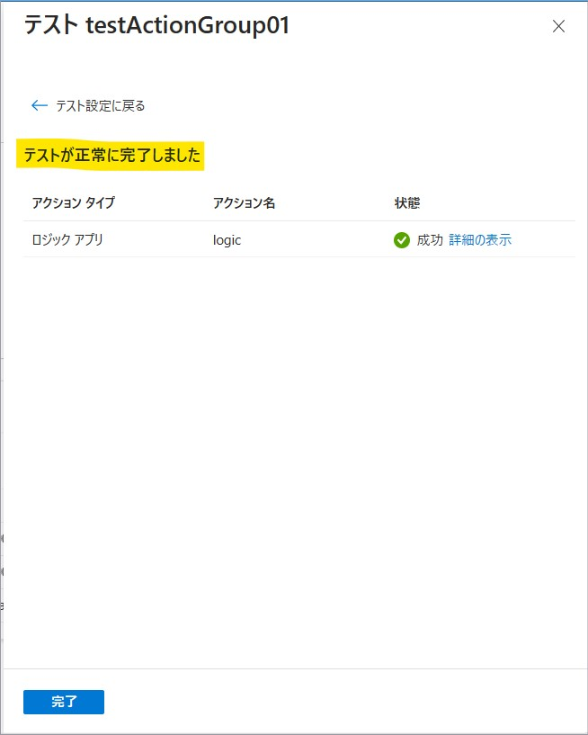

対象の Logic Apps の履歴を確認すると、トリガーが起動しています。
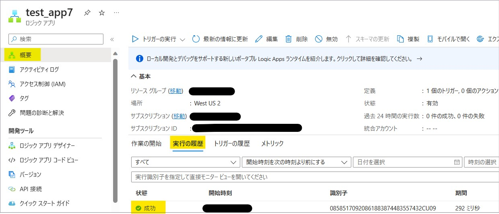

たとえば「ログ アラート V2」ですと、以下のようなスキーマが連携されます。
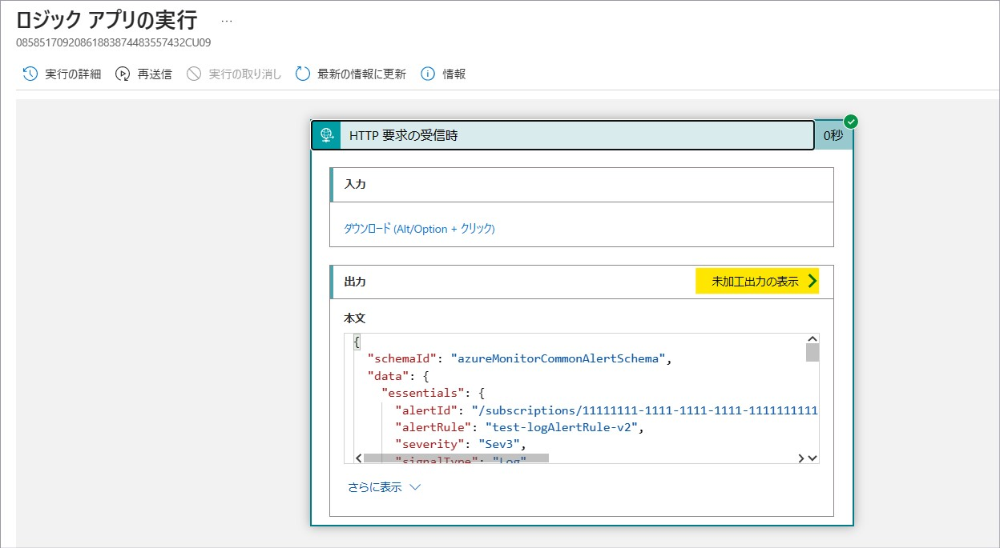

```json
{
  "schemaId": "azureMonitorCommonAlertSchema",
  "data": {
    "essentials": {
      "alertId": "/subscriptions/11111111-1111-1111-1111-111111111111/providers/Microsoft.AlertsManagement/alerts/12345678-1234-1234-1234-1234567890ab",
      "alertRule": "test-logAlertRule-v2",
      "severity": "Sev3",
      "signalType": "Log",
      "monitorCondition": "Fired",
      "monitoringService": "Log Alerts V2",
      "alertTargetIDs": [
        "/subscriptions/11111111-1111-1111-1111-111111111111/resourcegroups/test-RG/providers/microsoft.operationalinsights/workspaces/test-logAnalyticsWorkspace"
      ],
      "configurationItems": [
        "test-computer"
      ],
      "originAlertId": "22222222-2222-2222-2222-222222222222",
      "firedDateTime": "2023-05-19T16:46:38.738Z",
      "description": "Alert rule description",
      "essentialsVersion": "1.0",
      "alertContextVersion": "1.0"
    },
    "alertContext": {
      "properties": {
        "customKey1": "value1",
        "customKey2": "value2"
      },
      "conditionType": "LogQueryCriteria",
      "condition": {
        "windowSize": "PT1H",
        "allOf": [
          {
            "searchQuery": "Heartbeat",
            "metricMeasureColumn": null,
            "targetResourceTypes": "['Microsoft.OperationalInsights/workspaces']",
            "operator": "GreaterThan",
            "threshold": "0",
            "timeAggregation": "Count",
            "dimensions": [
              {
                "name": "Computer",
                "value": "test-computer"
              }
            ],
            "metricValue": 3,
            "failingPeriods": {
              "numberOfEvaluationPeriods": 1,
              "minFailingPeriodsToAlert": 1
            },
            "linkToSearchResultsUI": "https://portal.azure.com#@aaaaaaaa-aaaa-aaaa-aaaa-aaaaaaaaaaaa/blade/Microsoft_Azure_Monitoring_Logs/LogsBlade/source/Alerts.EmailLinks/scope/%7B%22resources%22%3A%5B%7B%22resourceId%22%3A%22%2Fsubscriptions%2F11111111-1111-1111-1111-111111111111%2FresourceGroups%2Ftest-RG%2Fproviders%2FMicrosoft.OperationalInsights%2Fworkspaces%2Ftest-logAnalyticsWorkspace%22%7D%5D%7D/q/aBcDeFgHiJkLmNaBcDeFgHiJkLmNaBcDeFgHiJkLmNaBcDeFgHiJkLmN1234567890ZAZBZiaGBlaG5lbKlnAAFRmnp6WNUZoqvTBAA%3D/prettify/1/timespan/2021-11-16T10%3a17%3a39.0000000Z%2f2021-11-16T11%3a17%3a39.0000000Z",
            "linkToFilteredSearchResultsUI": "https://portal.azure.com#@aaaaaaaa-aaaa-aaaa-aaaa-aaaaaaaaaaaa/blade/Microsoft_Azure_Monitoring_Logs/LogsBlade/source/Alerts.EmailLinks/scope/%7B%22resources%22%3A%5B%7B%22resourceId%22%3A%22%2Fsubscriptions%2F11111111-1111-1111-1111-111111111111%2FresourceGroups%2Ftest-RG%2Fproviders%2FMicrosoft.OperationalInsights%2Fworkspaces%2Ftest-logAnalyticsWorkspace%22%7D%5D%7D/q/aBcDeFgHiJkLmN%2Fl35oOTZoKioEOouaBcDeFgHiJkLmN%2BaBcDeFgHiJkLmN%2BaBcDeFgHiJkLmN7HHgOCZTR0Ak%2FaBcDeFgHiJkLmN1234567890Ltcw%2FOqZS%2FuX0L5d%2Bx3iMHNzQiu3Y%2BzsjpFSWlOzgA87vAxeHW2MoAtQxe6OUvVrZR3XYZPXrd%2FIE/prettify/1/timespan/2021-11-16T10%3a17%3a39.0000000Z%2f2021-11-16T11%3a17%3a39.0000000Z",
            "linkToSearchResultsAPI": "https://api.loganalytics.io/v1/workspaces/bbbbbbbb-bbbb-bbbb-bbbb-bbbbbbbbbbbb/query?query=Heartbeat%7C%20where%20TimeGenerated%20between%28datetime%282021-11-16T10%3A17%3A39.0000000Z%29..datetime%282021-11-16T11%3A17%3A39.0000000Z%29%29&timespan=2021-11-16T10%3a17%3a39.0000000Z%2f2021-11-16T11%3a17%3a39.0000000Z",
            "linkToFilteredSearchResultsAPI": "https://api.loganalytics.io/v1/workspaces/bbbbbbbb-bbbb-bbbb-bbbb-bbbbbbbbbbbb/query?query=Heartbeat%7C%20where%20TimeGenerated%20between%28datetime%282021-11-16T10%3A17%3A39.0000000Z%29..datetime%282021-11-16T11%3A17%3A39.0000000Z%29%29%7C%20where%20tostring%28Computer%29%20%3D%3D%20%27test-computer%27&timespan=2021-11-16T10%3a17%3a39.0000000Z%2f2021-11-16T11%3a17%3a39.0000000Z"
          }
        ],
        "windowStartTime": "2023-05-19T16:46:38.738Z",
        "windowEndTime": "2023-05-19T16:46:38.738Z"
      }
    }
  }
}
```
テスト実行ではサンプル データが利用されますので、実在するサブスクリプション ID やリソース グループは連携されません。

## Logic Apps 側のアクセス制限について
Logic Apps 側で受信トラフィックに制限を設けるご想定の場合には、アクション グループからの通信を許可する必要があります。

**<従量課金タイプ>**
従量課金タイプの場合、[ロジック アプリ] - [<対象の ロジック アプリ>] - [設定 - ワークフロー設定] にて受信トラフィックに制限を設けることが可能です。
こちらでアクション グループが利用している IP アドレスを許可します。
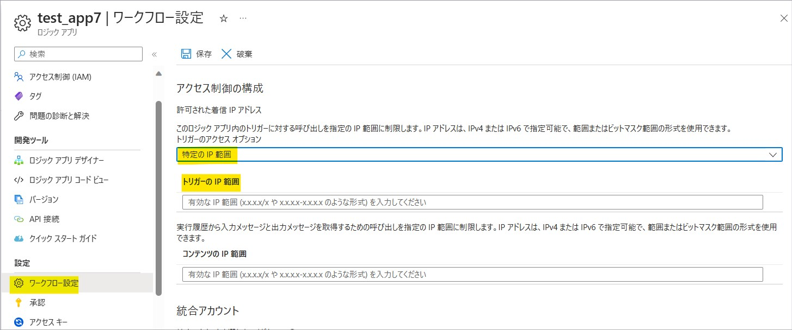

以下のダウンロード先より、アクション グループのサービス タグで利用されている IP アドレスを取得することが可能です。
- ダウンロード先 : [Azure IP Ranges and Service Tags – Public Cloud](https://www.microsoft.com/en-us/download/details.aspx?id=56519)

ダウンロードした JSON ファイルを開き、「ActionGroup」に該当する IP アドレスをすべて許可します。
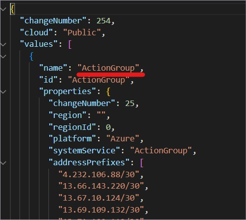

**<Standard タイプ>**
Standard Logic Apps の場合、[ロジック アプリ] - [<対象の ロジック アプリ>] - [設定 - ネットワーク] と遷移し、「受信トラフィック」の「アクセス制限」を選択します。
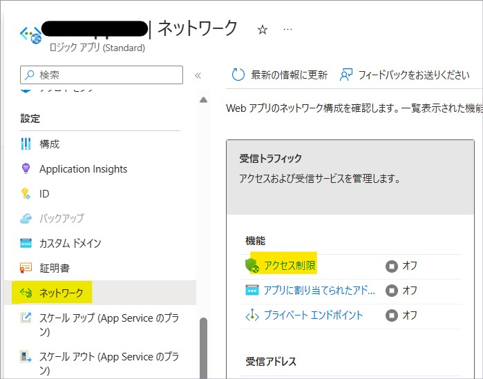

Standard Logic Apps では、サービス タグを利用してアクセス制限を行うことが可能です。

アクション グループからの通信を許可するためには、「ActionGroup」というサービス タグを許可するルールに追加する必要がございます。
- 参考ドキュメント : [Azure Monitor で使用される IP アドレス # アクション グループ サービス タグ](https://learn.microsoft.com/ja-jp/azure/azure-monitor/app/ip-addresses#action-group-service-tag)

以下のように許可ルールを追加いたします。
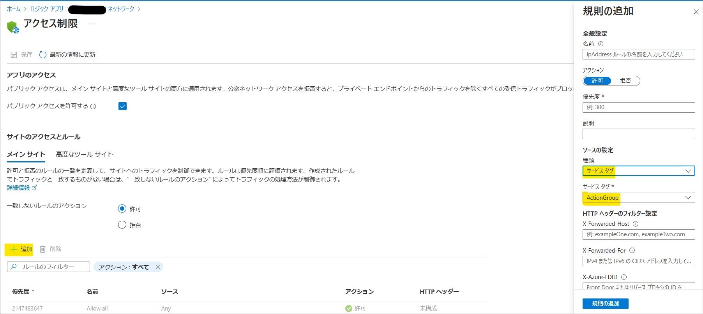

## まとめ
本記事では、Azure Monitor のアラート発報時に Logic Apps を起動させる方法と、そのテスト方法およびアクセス制限による諸注意についてご案内いたしました。
本記事が少しでもお役に立ちましたら幸いです。

## 関連記事
- [ログ アラート ルールの発報時に出力されたデータからクエリの検索結果を取得する](https://jpazinteg.github.io/blog/LogicApps/Integration-logAlertRule/)