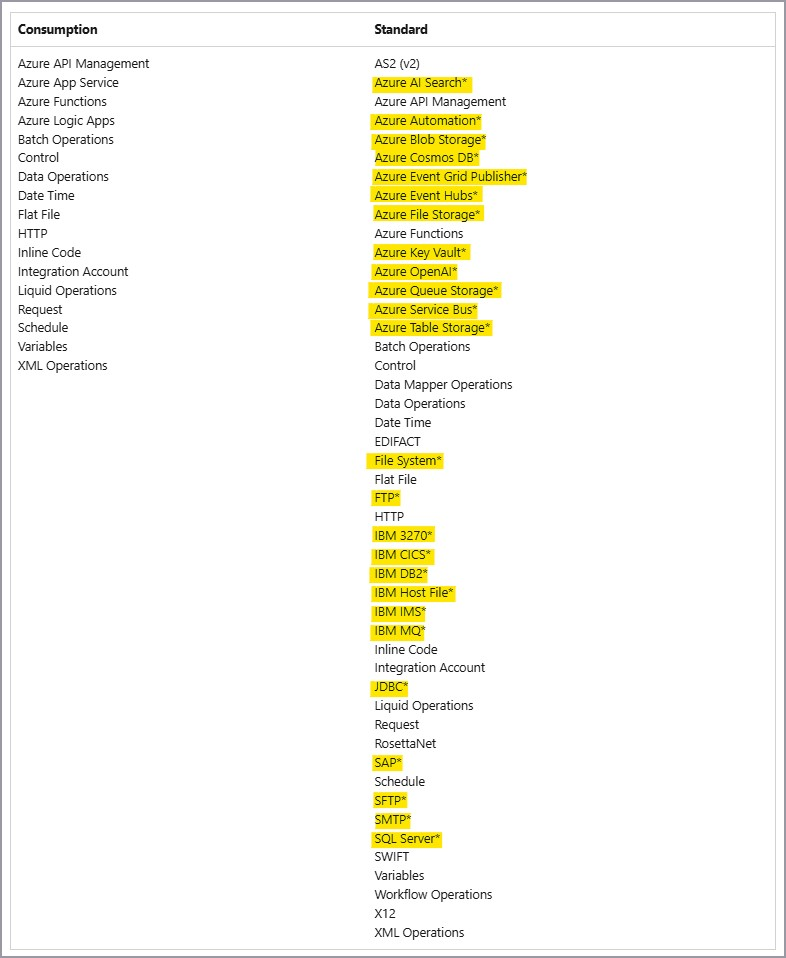
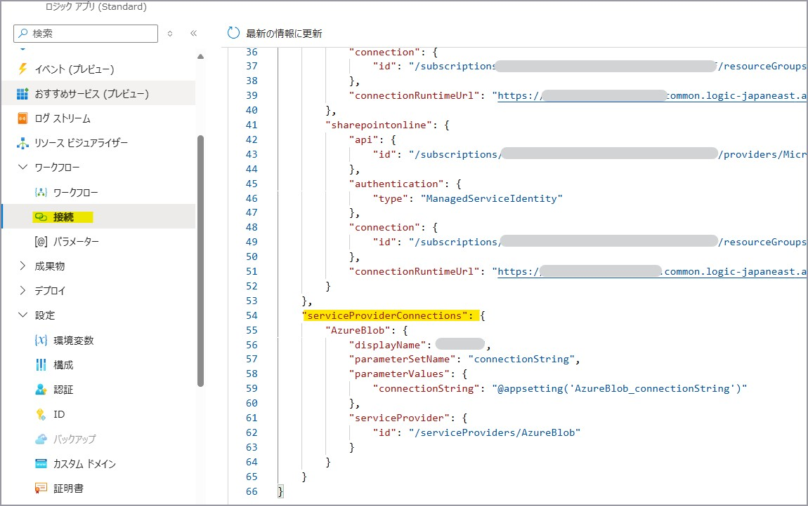
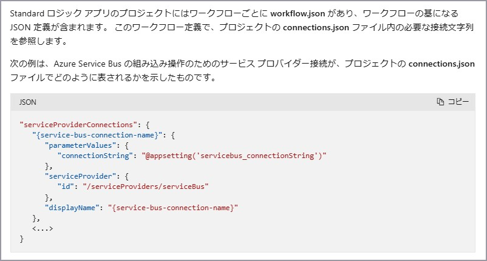
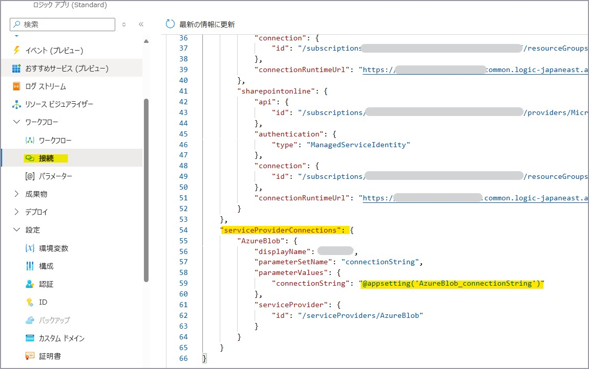
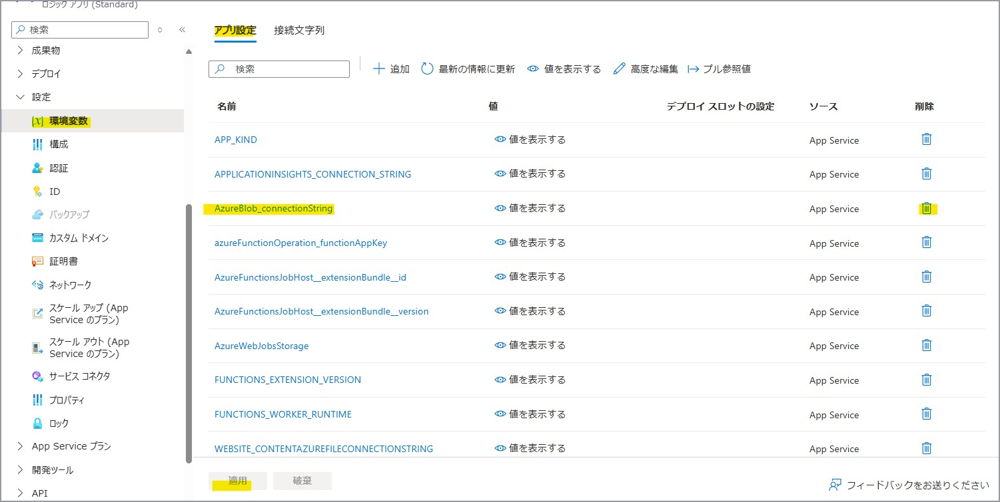
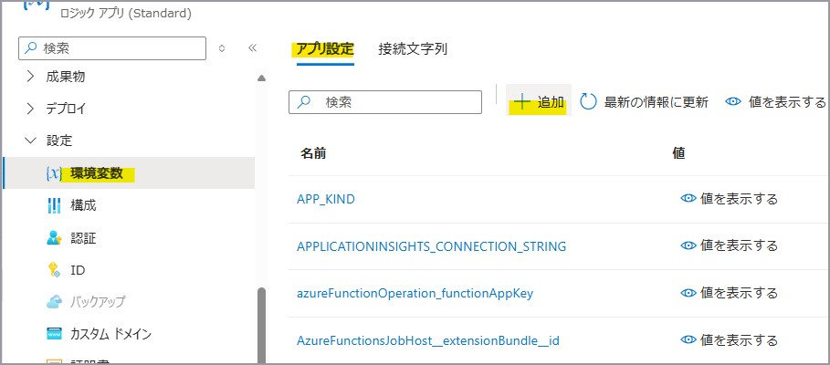

こんにちは。Azure Integration サポート チームの髙橋です。

Logic Apps の [サービス プロバイダー接続] について説明いたします。

<!-- more -->

## Logic Apps における [接続]
Logic Apps における [接続] やコネクタの種類等につきましては、関連記事にてご確認ください。
参考ドキュメント : [API 接続について](https://jpazinteg.github.io/blog/LogicApps/apiConnection/)

## 1. サービス プロバイダー接続とは
[サービス プロバイダー接続] は、組み込み (built-in) コネクタの中でもサービス プロバイダー ベース組み込みコネクタの認証情報を保持するものになります。
サービス プロバイダー ベース組み込みコネクタは、**Standard Logic Apps** でのみご利用いただけます。

- 組み込み (built-in) コネクタ全般について
参考ドキュメント : [Azure Logic Apps の組み込みコネクタ](https://learn.microsoft.com/ja-jp/azure/connectors/built-in)

- サービス プロバイダー ベース組み込みコネクタについて
参考ドキュメント : [Azure Logic Apps の組み込みコネクタ # サービス プロバイダーベースの組み込みコネクタ](https://learn.microsoft.com/ja-jp/azure/connectors/built-in#service-provider-based-built-in-connectors)

2025 年 1 月現在ですと、以下がサービス プロバイダー ベース組み込みコネクタになります。

参考ドキュメント : [Azure Logic Apps の組み込みコネクタ # 従量課金と Standard の組み込みコネクタの比較](https://learn.microsoft.com/ja-jp/azure/connectors/built-in#built-in-connectors-in-consumption-versus-standard)
参考ドキュメント : [Azure Logic Apps の組み込みコネクタ # 特定のサービスとシステム用の組み込みコネクタ](https://learn.microsoft.com/ja-jp/azure/connectors/built-in#built-in-connectors-for-specific-services-and-systems)

Standard Logic Apps にてトリガーやアクション追加時に、[In-app] にチェックを入れますとご確認いただけます。

### 注意点
[Azure Blob Storage] コネクタや [SQL Server] コネクタといったサービス プロバイダー ベース組み込みコネクタは、マネージド コネクタのご用意もあります。
サービス プロバイダー ベース組み込みコネクタをお使いいただくメリットとしましては、たとえば Standard Logic Apps 側の VNet 統合およびアクセス先のサービス側でのプライベート エンドポイントと組み合わせることで、Azure Blob Storage や Azure SQL Server 等にプライベートにアクセスすることが可能である点です。
詳細な手順は以下をご参照ください。
参考ドキュメント : [Standard Logic Apps から VNet 経由で別リソースにアクセスする方法](https://jpazinteg.github.io/blog/LogicApps/vnetIntergration/)

なお、サービス プロバイダー ベース組み込みコネクタとマネージド コネクタとで、一部項目の設定方法の違いや、認証方法の違い、動作の違いがある場合がありますので、ご注意ください。

例 [Azure Blob Storage] コネクタのトリガー

参考ドキュメント : [Azure Logic Apps のワークフローから Azure Blob Storage に接続する # BLOB トリガーを追加する](https://learn.microsoft.com/ja-jp/azure/connectors/connectors-create-api-azureblobstorage?tabs=consumption#add-a-blob-trigger)

### 2. 確認方法
上記の通り、[サービス プロバイダー接続] は Standard Logic Apps でのみ作成されます。
対象の Standard Logic Apps 内で利用している [サービス プロバイダー接続] は、[ワークフロー - 接続] の [サービス プロバイダー接続] タブにてご確認いただけます。

[サービス プロバイダー接続] は [API 接続] とは異なり、別リソースとして作成されません。

### 3. 削除方法
[ワークフロー – 接続] の [JSON ビュー] タブを開き、"serviceProviderConnections" 配下にある対象の [サービス プロバイダー接続] のプロパティを削除いただき、[保存] ボタンを押下いただくことで [サービス プロバイダー接続] タブの表示から削除されます。

[JSON ビュー] にてご確認いただける内容は、connections.json (※) に記載されております内容と同様になります。
(※) connections.json のご確認方法につきましては、以下をご参照ください。

参考ドキュメント : [シングルテナントの Azure Logic Apps の Standard ロジック アプリ向けの DevOps デプロイ # サービス プロバイダーの接続](https://learn.microsoft.com/ja-jp/azure/logic-apps/devops-deployment-single-tenant-azure-logic-apps#service-provider-connections)
参考ドキュメント : [シングルテナントの Azure Logic Apps に Standard ロジック アプリの DevOps デプロイを設定する # ポータルから Standard ロジック アプリの成果物をダウンロードする](https://learn.microsoft.com/ja-jp/azure/logic-apps/set-up-devops-deployment-single-tenant-azure-logic-apps?tabs=github#download-standard-logic-app-artifacts-from-portal)

たとえば、サービス プロバイダー ベース組み込みコネクタの [Azure Blob Storage] コネクタで接続文字列を認証に利用している場合、以下のように `@appsetting('{環境変数名}')` という記載形式になっております。
`@appsetting~` という記述は、[設定 - 環境変数] の [アプリ設定] タブにて登録されております環境変数の値を参照していることを意味しております。

こちらの環境変数が残存していることによってワークフローの動作に影響はございませんが、管理の面での混乱を避けるために削除いただくことも可能です。
該当の環境変数の右側の [ゴミ箱] ボタンを押下し、[適用] ボタンを押下することで削除いただけます。
なお、環境変数の変更を行いますと、Standard Logic Apps が再起動いたしますのでご注意ください。

### 4. デプロイ
[サービス プロバイダー接続] は別リソースではなく、connections.json および環境変数に認証に必要な情報が登録されます。

また、Standard Logic Apps におけるデプロイは、Standard Logic Apps (基盤側) のデプロイと、workflow.json、connections.json、host.json を含むアプリ成果物のデプロイの大きく二つに分かれます。
[サービス プロバイダー接続] の情報もデプロイするためには、以下の方法がございます。

> "シングルテナント" の Azure Logic Apps の場合は、Standard ロジック アプリのリソースとインフラストラクチャの間でリソースのプロビジョニングを分離できるため、デプロイが簡単になります。

参考ドキュメント : [シングルテナントの Azure Logic Apps の Standard ロジック アプリ向けの DevOps デプロイ # シングルテナントとマルチテナント](https://learn.microsoft.com/ja-jp/azure/logic-apps/devops-deployment-single-tenant-azure-logic-apps#single-tenant-versus-multi-tenant)

1. Standard Logic Apps をデプロイする
ARM テンプレート等を用いて Standard Logic Apps (基盤側) をデプロイします。
※ Standard Logic Apps の場合ですと、この他ストレージ アカウントや App Service Plan 、必要に応じて Application Insights や VNet 等のデプロイも必要ですが、本記事では説明を割愛させていただきます。
Standard Logic Apps (基盤側) をデプロイする際に、ARM テンプレート内に環境変数を含めることが可能です。
以下、参考情報になります。
参考ドキュメント : [シングルテナントの Azure Logic Apps に Standard ロジック アプリの DevOps デプロイを設定する # インフラストラクチャ リソースのデプロイ](https://learn.microsoft.com/ja-jp/azure/logic-apps/set-up-devops-deployment-single-tenant-azure-logic-apps?tabs=github#deploy-infrastructure-resources)
既存の Standard Logic Apps (基盤側) に対して、環境変数を手動で追加することも可能です。
[設定 - 環境変数] の [アプリ設定] タブにて [+ 追加] ボタンを押下し、環境変数名および値を設定できます。

2. zip デプロイを行う
zip デプロイによってワークフロー (アプリケーション側) をデプロイすることが可能です。
zip デプロイに利用する zip ファイルは、移行元の Standard Logic Apps の [概要] より取得いただけます。
参考ドキュメント : [シングルテナントの Azure Logic Apps に Standard ロジック アプリの DevOps デプロイを設定する # ポータルから Standard ロジック アプリの成果物をダウンロードする](https://learn.microsoft.com/ja-jp/azure/logic-apps/set-up-devops-deployment-single-tenant-azure-logic-apps?tabs=github#download-standard-logic-app-artifacts-from-portal)
このとき、zip ファイルには [サービス プロバイダー接続] 等の接続情報を保持している connections.json ファイルが含まれております。
zip デプロイの際に、この connections.json に必要な [サービス プロバイダー接続] の情報を含めることが可能です。
以下の手順に従い、zip デプロイを行います。
参考ドキュメント : [シングルテナントの Azure Logic Apps に Standard ロジック アプリの DevOps デプロイを設定する # Azure へのリリース](https://learn.microsoft.com/ja-jp/azure/logic-apps/set-up-devops-deployment-single-tenant-azure-logic-apps?tabs=azure-cli#release-to-azure)
マネージド ID 認証をご利用の場合には、デプロイ先の Standard Logic Apps のマネージド ID に必要なロールが付与されているかもご確認ください。

## まとめ
本記事では、Logic Apps で利用される [サービス プロバイダー接続] についてご案内いたしました。
本記事が少しでもお役に立ちましたら幸いです。

## 関連記事
以下、Logic Apps における [接続] についての関連記事になります。
- [API 接続について](https://jpazinteg.github.io/blog/LogicApps/apiConnection/)
