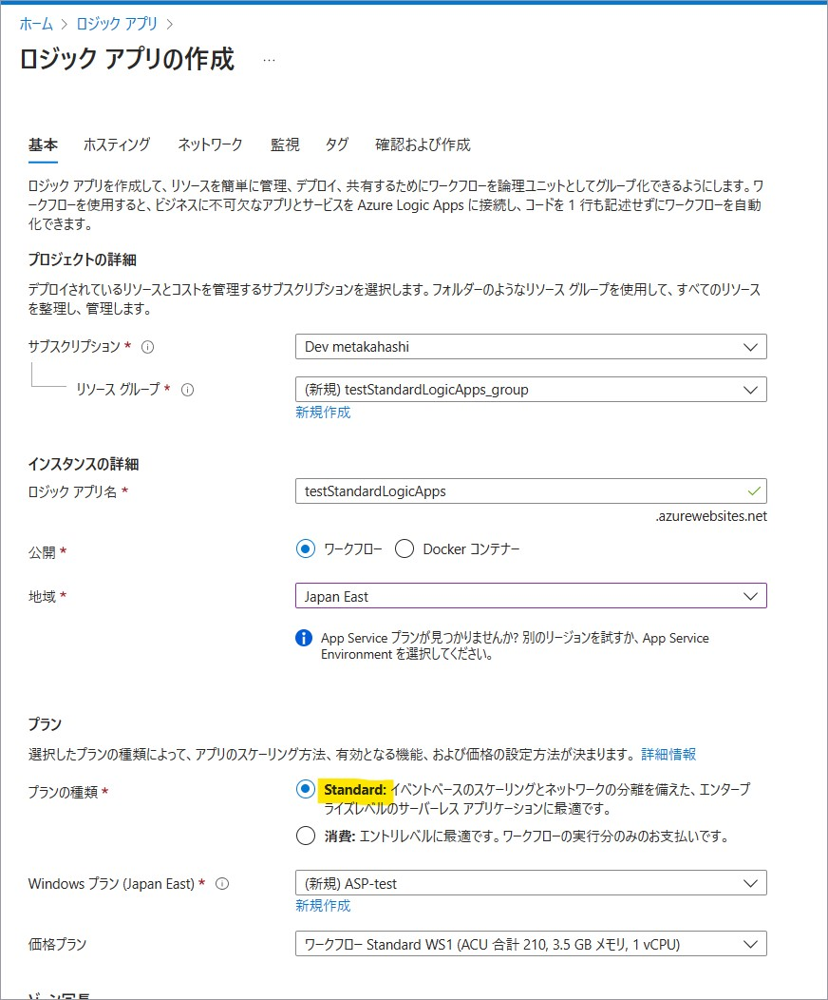
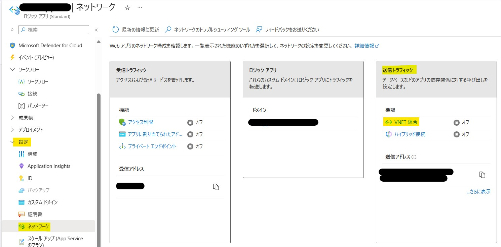
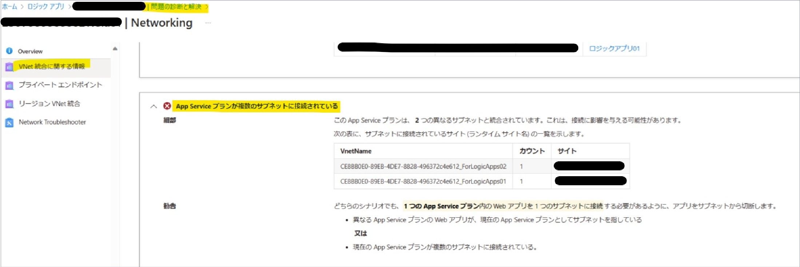
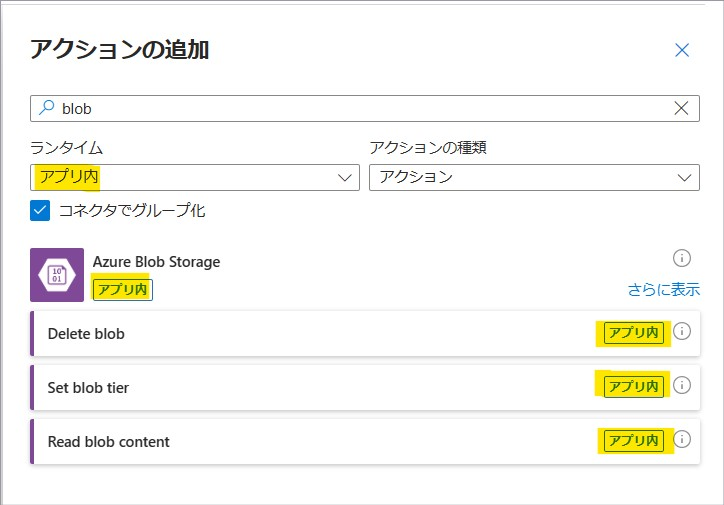
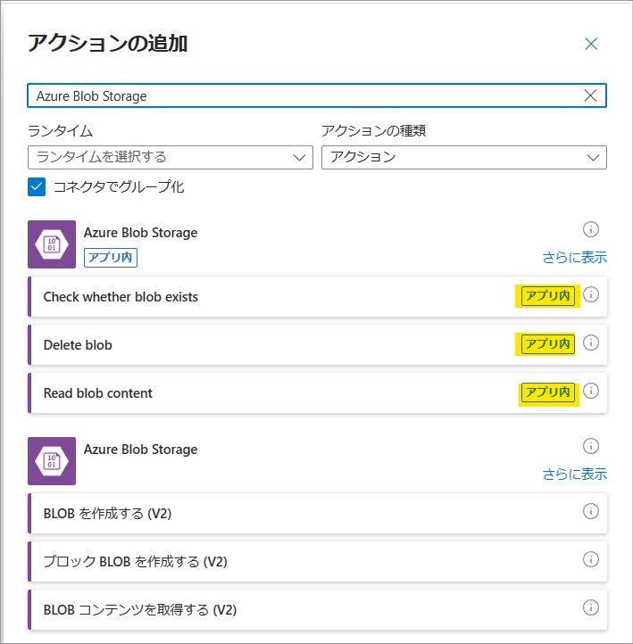
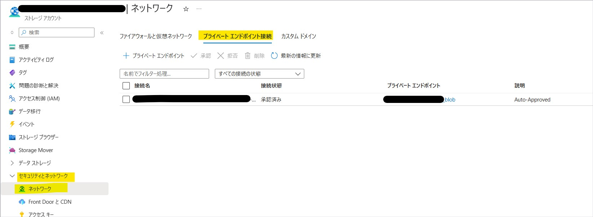

こんにちは。Azure Integration サポート チームの髙橋です。

Standard Logic Apps から VNet 経由で別リソースにアクセスする方法について説明いたします。

<!-- more -->

## こんな方におすすめです
- VNet 統合を有効化し、VNet 経由で Azure Blob Storage 等にアクセスされたい方

## VNet を経由する条件
Logic Apps から別リソースにアクセスする際に、VNet を経由するためにはいくつかの条件があります。
- Standard Logic Apps を利用する
- VNet 統合を有効化する
- built-in (組み込み) タイプのコネクタを利用する
- アクセス先のリソースに、サービス エンドポイントまたはプライベート エンドポイントを用意する

## 手順
以下の例では、VNet を経由して Azure Blob Storage にアクセスする方法をご紹介します。

### Standard Logic Apps を利用する
Standard Logic Apps を新規に作成します。

Standard Logic Apps と従量課金 タイプの違いにつきましては、以下の公開情報に記載があります。
- 参考ドキュメント : [Azure Logic Apps でのシングルテナント、マルチテナント、統合サービス環境の比較](https://learn.microsoft.com/ja-jp/azure/logic-apps/single-tenant-overview-compare)

### VNet 統合を有効化する
VNet 統合の有効化につきましては、以下の公開情報にも詳細について記載があります。
- 参考ドキュメント : [仮想ネットワーク統合を使って送信トラフィックを設定する](https://learn.microsoft.com/ja-jp/azure/logic-apps/secure-single-tenant-workflow-virtual-network-private-endpoint#set-up-outbound-traffic-using-virtual-network-integration)

適宜 VNet を作成し、Logic Apps 用のサブネットを用意します。
[設定 - ネットワーク] を開き、「送信トラフィック」の「VNet 統合」を選択します。

作成しておいた Logic Apps 用のサブネットを選択します。
このとき、VNet 統合に利用するサブネットは空で、かつ委任されていない状態である必要があります。
別リソースで既に利用されているものは、「統合に使用不可」となり選択いただくことができかねます。

なお、ご参考とはなりますが、同一 App Service プランを利用している複数の Standard Logic Apps において、
それぞれで異なるサブネットを VNet 統合に利用することは推奨されておりません。
設定自体は可能でございますが、[問題の診断と解決] - [Networking] - [VNet 統合に関する情報] にて、以下のような警告が表示されます。

Logic Apps 側の公開情報ではなく、類似製品の Web Apps 側の公開情報とはなりますが、以下のような記載があります。

- 参考ドキュメント : [アプリを Azure 仮想ネットワークと統合する # 制限事項](https://learn.microsoft.com/ja-jp/azure/app-service/overview-vnet-integration#limitations)

### built-in (組み込み) タイプのコネクタを利用する
built-in (組み込み) タイプのコネクタは、トリガーおよびアクション追加時に「ランタイム」にて「アプリ内」にチェックを入れることで検索いただくことが可能です。
今回の例では、built-in タイプの「Azure Blob Storage」コネクタを利用します。

「Azure Blob Storage」コネクタには、built-in (組み込み) タイプのコネクタと、マネージド コネクタの 2 種類のご用意がございます。
「アプリ内」マークがござますのが、built-in (組み込み) タイプとなります。

built-in (組み込み) タイプのコネクタは、Azure Functions 拡張性モデルに基づいており、Azure Logic Apps ランタイムと同じプロセスで実行されます。
詳細につきましては、以下の公開情報があります。
- 参考ドキュメント : [Azure Logic Apps の組み込みコネクタ](https://learn.microsoft.com/ja-jp/azure/connectors/built-in)

以下に記載の通り、built-in (組み込み) タイプのコネクタをご利用いただいた場合のみ、VNet を経由することが可能です。

- 参考ドキュメント : [Azure Logic Apps (Standard) での組み込み操作と Azure コネクタの違い # 仮想ネットワーク統合に関する考慮事項](https://learn.microsoft.com/ja-JP/azure/connectors/compare-built-in-azure-connectors#considerations-for-virtual-network-integration)

また、built-in (組み込み) タイプのコネクタは、マネージド コネクタに比べて種類が少ないため、ご希望のリソースに対応しているコネクタのご用意がない場合もございます。
この点につきましても、ご理解賜れますと幸いです。
- 参考ドキュメント : [Azure Logic Apps の組み込みコネクタ # 従量課金と Standard の組み込みコネクタの比較](https://learn.microsoft.com/ja-jp/azure/connectors/built-in#built-in-connectors-in-consumption-versus-standard)

なお、マネージド コネクタをご利用いただいた場合には、**VNet 統合を有効化していても**コネクタを経由した後に対象リソースへアクセスする動作となりますので、
パブリック IP アドレスからの通信となります。
ただし、アクセス先のリソースが Microsoft 製品の場合、Microsoft のネットワークにルーティングされ、パブリック インターネットは経由いたしません。
以下、公開資料からの抜粋となります。

- 参考ドキュメント : [マイクロソフトのグローバル ネットワーク # 最高のクラウド ネットワークの実現](https://learn.microsoft.com/ja-jp/azure/networking/microsoft-global-network#get-the-premium-cloud-network)

VNet 統合を有効化していて、かつマネージド コネクタもご利用されたい場合には、マネージド コネクタへ向かう通信 (サービス タグ「AzureConnectors.{リージョン}」を宛先とする通信) を、
NSG や Azure Firewall 等で許可する必要があります。

- 参考ドキュメント : [Azure Logic Apps (Standard) での組み込み操作と Azure コネクタの違い # 仮想ネットワーク統合に関する考慮事項](https://learn.microsoft.com/ja-JP/azure/connectors/compare-built-in-azure-connectors#considerations-for-virtual-network-integration)
- 参考ドキュメント : [Azure Logic Apps の制約と構成の参考文献 # ファイアウォールの IP 構成に関する考慮事項](https://learn.microsoft.com/ja-jp/azure/logic-apps/logic-apps-limits-and-config?tabs=consumption%2Cazure-portal#firewall-ip-configuration-considerations)
- 参考ドキュメント : [マネージド コネクタのアウトバウンド IP アドレス # Azure Logic Apps](https://learn.microsoft.com/ja-jp/connectors/common/outbound-ip-addresses#azure-logic-apps)

### アクセス先のリソースに、サービス エンドポイントまたはプライベート エンドポイントを用意する
今回の例では、ストレージ アカウント側で blob のプライベート エンドポイントを作成します。
Standard Logic Apps の VNet 統合に利用したサブネットと、同一 VNet 内の異なるサブネットに配置しています。

上記の設定によって、VNet およびプライベート エンドポイントを経由しての通信が可能です。

## まとめ
本記事では、Standard Logic Apps から VNet 経由で別の Azure リソースにアクセスする方法についてご案内いたしました。
本記事が少しでもお役に立ちましたら幸いです。